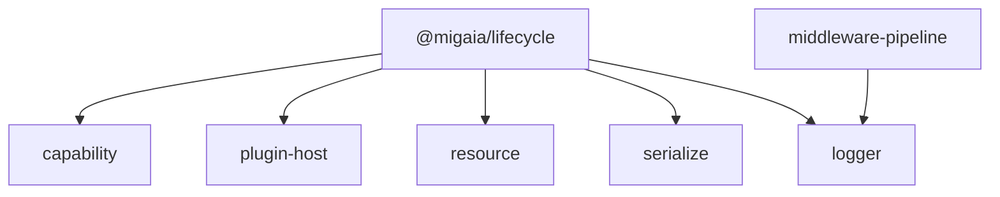

# SDD：`@migaia/lifecycle` —— 唯一生命周期底座

## 0. 状态与闭合规则

- 状态：`verified`（2026-08-18；dirty worktree）。Round30 修复与最终 package/direct-consumer gates 已闭合；历史表格中的 `implemented-unverified` 是执行时快照，由本状态和 Round30 current evidence supersede。
- 范围：`packages/lifecycle` 的唯一生命周期底座及公开契约；本文不替代调用方迁移验收。
- 所有者：`packages/lifecycle`。
- 依赖方向：零运行时依赖叶子包；由 `capability`、`plugin-host`、`resource`、`serialize`、`logger` 等上层包依赖，生命周期不得反向依赖它们。
- 受影响包：`@migaia/lifecycle` 及其直接消费者；Store 包和 Store SDD 不在本任务范围。
- 前置文档：`docs/contracts/runtime-neutrality.sdd.md`、`docs/contracts/error-codes.md`。
- 关联文档：`docs/lifecycle/migration.sdd.md`、`docs/tray/tray.sdd.md`、`docs/review/foundation-runtime-adversarial-audit.sdd.md`。
- 历史证据：保留原有 D-1～D-6、L-T1～L-T44、LG-R5-1～LG-R5-3 和历史测试计数，不把旧计数当作当前闭合证据。

闭合规则：本文沿 `pending → red → implemented → verified` 推进；`blocked` 只用于真实外部阻断，`deferred` 必须指定独立 owner 和目标文档。AF-61/AF-62/AF-73/AF-74、D-7～D-13、D-15、D-19、L-R01/L-R02/L-R07～L-R09/L-R11/L-R15、L-T45～L-T55、L-T57、L-T61 当前为 `implemented-unverified`。每条不变量、设计条款和并发门禁都必须映射到测试；每个测试 case 都必须反向映射到条款。错误、取消、scheduler、task 和 disposer 的原始 identity 必须可验证。

## 1. 目标与范围

### 1.1 目标

终结全仓多套 scope、generation、lease、pending 和 deadline 实现，提供唯一、runtime-neutral、可组合的生命周期底座：

1. scope 的 close/dispose 两阶段、终态和 Promise identity 一致。
2. generation、AbortSignal、父 closing、迟到结果和 cleanup 失败一致。
3. quiescence、lease、pending drain 共享一个计数/epoch 原语。
4. release descriptor 只表达释放意图；本包不理解领域依赖、不计算拓扑序。
5. `throw`、`collect`、`report`、`firstError` 的错误出口和 cause 可达性固定。
6. 所有注入 scheduler 在 admission 处单次读取方法和 receiver；task 的 cancel 也在返回边界单次捕获（AF-62）。
7. abort listener 基于快照完整 fan-out；单个 listener 失败不得阻断后续 listener，全部错误保持 identity（AF-61）。
8. abort listener 注册去重；重复取消注册只产生一个有效取消动作，listener/cancellation cleanup 失败分别由 `ABORT_LISTENER_FAILED` 与 `GENERATION_CANCELLATION_FAILED` 归属（AF-73）。
9. Generation parent registration 采用 invoke-then-store；注册或保存失败时回滚已取得的 parent unregister，不能留下半注册 generation（AF-74）。
10. Provisional parent-signal registration 在 stored-then-throw、invoke-then-store 和 post-return abort/reason race 下都可强制移除；registration primary 与 cleanup failures 保持 identity 可达（L-R03）。
11. DisposeTransaction signal registration/cleanup failure 不跳过 item release、pending drain 或 collector finalize；remove failure 作为 secondary，遵循既有 error policy（L-R04）。
12. MutationQueue admission timeout 即使 scheduler callback 同步执行，也取消返回 task 恰好一次；cancel failure 挂在 timeout primary 上，队列继续可用（L-R05）。
13. DisposeTransaction 在每个 item 执行前独立 snapshot/admit descriptor；单个 getter/值失败不得阻断后续释放，order-mode 只对已 admission 的数值 order 做稳定排序（L-R07）。
14. MutationQueue 正常 dequeue 的 watchdog disarm 若 `cancel()` 失败，错误进入 queue diagnostic channel，不能替换 mutation 结果或阻断 shifted item；该 task 取消最多尝试一次（L-R08）。
15. DisposeTransaction descriptor 的 `gracefulTimeoutMs` 必须在执行前为有限非负数；非法 item 以 `INVALID_OPTION` 独立记录并跳过，后续 item 按全部 error policy 继续（L-R09）。
16. Round20：scheduler 是时间值准入的唯一 owner。所有 lifecycle public API 通过 scheduler snapshot 的同一 validator 拒绝 non-number/非有限/负 delay；原生 `TypeError`/`RangeError` 保留并带 `INVALID_OPTION`；strictly past deadline 早退且不 schedule，exact-now deadline 仍向 injected scheduler 传 `0`，非法 admission 不得留下 task（L-R11）。
17. Round21：manual scheduler 必须校验 `schedule()` 的 `now + delayMs` 与 `advance()` 的 `now + ms` 结果仍有限；溢出以带 `INVALID_OPTION` 的原生 `RangeError` 在任务插入、时钟变更和 callback 前拒绝，并保持 queue/now 不变；有限最大值与零值仍有效，排序语义不变（L-R12）。
18. Round23：`systemScheduler.now()` 必须通过 canonical `validateSchedulerTime` 校验 `performance.now()` 结果；NaN/Infinity 以带 `INVALID_OPTION` 的原生 `RangeError`、非 number 以原生 `TypeError` 拒绝；receiver、原始 throw、宿主缺失 `ENV_UNSUPPORTED` 和 finite/zero success 保持，失败不得触发 timer/task 下游副作用（L-R13）。
    19. Round24：`GenerationController.begin()` 必须在读取并验证 `timeoutMs` 及其 derived delay 后，才 abort 当前 generation 或递增 generation；invalid timeout/accessor failure 不得改变当前 token、signal、generation 或 timer admission（L-R14）。
    20. Round25：GenerationController 的同步 scheduler callback 必须暂存 callback cleanup failure，直到 `schedule()` 返回 task；task 只 cancel 一次。callback primary、cancel/schedule/task-getter/parent-retry cleanup failures 保持顺序和 identity，generation 作废状态不回滚且不得泄漏 parent listener（L-R15）。

### 1.2 范围内 API

`TerminalController`、`LifecycleScope`、`SyncLifecycleScope`、`LifecycleUnit`、`GenerationController`、`QuiescenceTracker`、`LeaseRegistry`、`PendingTracker`、`ProvisionalScope`、`MutationQueue`、`DisposeTransaction`、`boundedWait`、`containAsyncRejection`、abort controller、scheduler 和错误策略层。

### 1.3 非目标与禁止领域

- 不引入 `store`、`plugin`、`capability`、`service`、`rpc`、`storage`、`sink`、`field`、`endpoint` 或响应式 `signal` 领域名词到公开 API。
- 不做拓扑排序、环检测、邻接表或依赖图计算；已排好序的 plan 由调用方提供。
- 不实现 ready/blocked/stale 等领域可用性状态。
- 不拥有 Store、UI、DOM、Node、Worker、persistence 或 adapter 语义。
- 不为保持旧 API 而在通用 `LifecycleScope` 上保留同步 `dispose()`；同步场景使用独立 `SyncLifecycleScope`。

## 2. 现状与问题

### 2.1 当前唯一职责

生命周期是 runtime-neutral foundation。它只使用 Promise、AbortController、WeakMap、Map、Set 和可选 FinalizationRegistry；可选宿主能力必须 fail-fast。上层包只能消费公开原语，不能重新实现 generation、lease、pending、deadline、rollback 或 scheduler 状态机。

### 2.2 既有不变量与历史来源

本包是各家实现的并集，不是交集。下表中的行为契约全部保留，case ID 不重编号。

| 不变量 | 历史唯一实现 | 归入 |
| --- | --- | --- |
| sync/async 双向重入守卫；错误归属触发重入的 disposer，其余继续释放 | `reactive/src/runtime/lifecycle-primitives.ts:183-229` | LifecycleScope |
| 排空到不再产生新的 pending epoch | `capability/src/index.ts:445-454` | PendingTracker / QuiescenceTracker |
| 代数不匹配时释放刚拿到的产物 | `capability/src/index.ts:398-401` | GenerationController |
| 旧代清理失败不污染新代状态 | `capability/src/index.ts:283-299` | GenerationController |
| thenable 的 `then` 只读取一次 | `capability/src/index.ts:129-137` | containAsyncRejection |
| 绝对 deadline 跨步骤传递 | logger `bounded-wait.ts` 与 `log.ts`（LG-R5-1） | boundedWait |
| 超时不取消被等待 task | logger `bounded-wait.ts` | boundedWait |
| 超时后仍先观测 task，避免 unhandledRejection | logger `bounded-wait.ts`（LG-R5-3） | boundedWait |
| task 胜出时清理 timer | logger `bounded-wait.ts`（LG-R5-2） | boundedWait |
| 父 closing signal 自动 abort 子操作 | `web-rpc/src/internal/operation-scope.ts:24-25` | GenerationController |
| `add()` 返回的 unregister 幂等 | `web-rpc/src/internal/resource-scope.ts:37-39` | LifecycleScope |
| 释放全过程复用同一 Promise | `web-rpc/src/internal/resource-scope.ts:44` | LifecycleScope |
| 取出与遍历原子化 | `store-middleware/src/store-middleware-host.ts:174` | LifecycleScope |
| retain 返回的 release 幂等 | `reactive/src/runtime/lifecycle-primitives.ts:84-95` | QuiescenceTracker |
| 串行 FIFO mutation queue，settle 即 disarm watchdog | `plugin-host/src/host-runtime.ts:153-175` | MutationQueue |
| report 回调抛错不污染释放 Promise | `capability/src/index.ts:271-281` | 错误策略层 |
| firstError 保留首错并观测后续错误 | `web-rpc/src/internal/discovery-registry.ts:440-475` | firstError |
| 构造失败资源按逆序释放 | `store-wasm`、`plugin-host` | ProvisionalScope |
| cleanup 错误不得覆盖原始构造错误 | `store-wasm`、`plugin-host` | ProvisionalScope |

### 2.3 AF-60 历史闭合纠正

AF-60 曾把 lifecycle scheduler、PluginHost、Resource、Serialize 的四类 admission 契约合并成一个完成声明。该声明过宽，保留为历史 ID，但不得作为当前证据。当前分别由 AF-61/AF-62、AF-63、AF-64、AF-65、AF-68 覆盖；本文件只负责 AF-61/AF-62。

| ID | 状态 | 现状问题 | 当前证据状态 |
| --- | --- | --- | --- |
| AF-61 | implemented-unverified | abort listener 若首错中断 fan-out，会导致 signal 已 aborted 但后续取消/清理未执行。 | `abort.ts` 已采用 listener snapshot、全量执行和聚合；`AF-T61` 已在测试文件中，完整 package gate 尚未由本文重取。 |
| AF-62 | implemented-unverified | scheduler、task handle 的 getter/method/cancel accessor TOCTOU 会造成时钟漂移、裸 TypeError 或取消路径失效。 | `resolveScheduler`/`snapshotScheduler` 已覆盖 lifecycle factory；`AF-T62` 与 invalid task case 已在测试文件中，完整 gate 尚未由本文重取。 |
| AF-73 | implemented-unverified | abort listener 去重与 cancellation cleanup 失败没有独立错误归属，重复 listener 可能重复取消。 | abort listener registration/dedupe 与 dedicated error paths 已进入当前工作树；package/main gate 尚未重取。 |
| AF-74 | implemented-unverified | GenerationController parent registration 若先存后调用或部分失败，会留下不可注销的 parent listener。 | parent registration rollback 与 invoke-then-store 已进入当前工作树；package/main gate 尚未重取。 |
| L-R07 | implemented-unverified | DisposeTransaction 的 descriptor getter/值失败可在 order sort 或 release loop 外层中断整批释放。 | 每项先 snapshot/admit；无效项排除执行但按 error policy 记录；有效项继续保持 plan/LIFO/order，待 package gates 重取。 |

## 3. 架构裁定与依赖方向

### 3.1 历史裁定（保留 ID）

| ID | 裁定 | 依据 |
| --- | --- | --- |
| D-1 | 通用 `LifecycleScope.dispose()` 唯一且异步；同步需求由 `close()` 或独立 `SyncLifecycleScope` 承担 | §4.1、§5.1 |
| D-2 | 装载态由运行时 thenable 探测驱动，不由静态声明驱动 | §4.2 |
| D-3 | 释放顺序是输入，不是本包计算结果 | §4.6 |
| D-4 | 错误策略为 `throw` / `collect` / `report` / `firstError` 四出口，内层不抛穿外层 | §5.3 |
| D-5 | 领域释放动作走 descriptor 降级链或 `custom`，不进入核心 | §4.5 |
| D-6 | 通用 scope 不暴露同步 `[Symbol.dispose]`；同步场景使用独立 `SyncLifecycleScope` | §4.1 |
| D-7 | abort 先固化不可逆状态并快照 listener，再完整 fan-out；错误在 fan-out 后按明确策略处理 | AF-61 |
| D-8 | scheduler 在注入 factory 边界快照方法/receiver；schedule 返回 task 在返回边界快照 cancel | AF-62 |
| D-9 | abort listener registration 去重；listener failure 与 generation cancellation cleanup failure 使用独立错误归属并保留原始 cause | AF-73 |
| D-10 | GenerationController parent registration 先调用、成功后存储 unregister；任一后续保存失败都执行回滚并保持 primary | AF-74 |
| D-11 | DisposeTransaction 先逐项 admission descriptor，再执行计划；order-mode 对已 admission 的有限数值 key 做稳定排序，无效项不执行但错误按输入顺序进入 policy collector | L-R07、L-T53 |
| D-12 | MutationQueue dequeue 先从队列移出 item，再 exactly-once disarm watchdog；cancel failure 只进 diagnostic channel，item 仍执行并继续 drain 后续队列 | L-R08、L-T54 |
| D-13 | DisposeTransaction admission 将 `gracefulTimeoutMs` 作为有限非负值校验；无效 item 不执行 release callback，错误按 item/source 和当前 policy 交付 | L-R09、L-T55 |
| D-14 | LifecycleScope 的 descriptor guard 只提供 lazy callback facade；own/snapshot 边界不预读 user fields，`DisposeTransaction` 保持唯一 descriptor admission owner | L-R10、L-T56 |
| D-15 | scheduler snapshot 统一校验 now/delay；public API 不重复实现 validator；exact-now deadline 归一为 0，strictly past deadline 早退不 schedule，invalid schedule admission 在队列/代际/事务边界清理掉输入 item | L-R11、L-T57 |
| D-16 | scheduler 对由有限时钟与有限增量相加得到的 dueAt/advance target 做结果校验；溢出在任何状态或用户 callback 变化前以 `INVALID_OPTION`/`RangeError` 拒绝，并复用同一加法 guard 处理 lifecycle deadline arithmetic | L-R12、L-T58 |
| D-17 | systemScheduler 的 `performance.now()` 结果复用 `validateSchedulerTime`；invalid host clock 在下游副作用前以对应 native error type/`INVALID_OPTION` 拒绝，receiver、原始 throw 和 `ENV_UNSUPPORTED` 保持。 | L-R13、L-T59 |
| D-18 | GenerationController begin admission 先 snapshot/validate timeout，再进行 generation supersede；invalid input preserves current state exactly。 | L-R14、L-T60 |
| D-19 | GenerationController 对同步 timeout callback 使用 capture → acquire → cancel → throw 顺序；callback failure 是 primary，返回 task 的 cancel、schedule/task getter 和 residual parent cleanup failure 按发生顺序附加，generation 不复活且 parent listener 不残留 | L-R15、L-T61 |

### 3.2 所有权与依赖图



lifecycle 拥有 scope、generation、lease、pending、scheduler、task、abort、deadline 和错误策略原语；上层包只组合这些原语。不得为了共享 validator 建立反向依赖。middleware 的 stage/downstream execution algebra 与 lifecycle 的 disposer/generation semantics 分离。

### 3.3 复用与拒绝的重复路径

- `boundedWait`、`resolveScheduler`、`snapshotScheduler`、`containAsyncRejection` 和错误 tag 是 canonical path。
- 上层不得直接保存未 snapshot 的 scheduler，不得重复实现 task cancel validator。
- 上层不得自行实现 scope dispose、generation invalidation、pending epoch、abort fan-out 或 shared deadline。
- graph/依赖计算归 capability/graph；lifecycle 只执行已排序 plan。

## 4. 公开契约/核心设计

### 4.1 两阶段 scope

| | `close()` | `dispose()` |
| --- | --- | --- |
| 同步性 | 同步 | 异步，唯一释放入口 |
| 是否可失败 | 不调用用户代码，不失败 | 按错误策略返回或抛出 |
| 是否调用用户代码 | 否 | 是 |
| 语义 | 停止新工作、标记 closing、级联 close | 执行释放并到 terminal |
| 幂等 | 是 | 是；复用同一 Promise |

状态不可逆：`open → closing → terminal`。`dispose()` 先执行隐含 `close()`，不存在 `open → terminal` 直跳。通用 scope 恒暴露 `[Symbol.asyncDispose]`；`SyncLifecycleScope` 仅接受 `syncSafe: true` descriptor 并暴露 `[Symbol.dispose]`。

### 4.2 单元与 generation

单元状态：`idle → loading → loaded` 或 `loading → failed`；failed 只能由显式 start/restart 进入新 generation，dispose/close 进入 terminal。thenable 由运行时探测，不能用函数声明形态猜测。

`GenerationController` 为每代生成 token、AbortSignal 和可选 deadline。新代开始先作废旧代，旧结果不能提交；代数不匹配时必须释放产物。父 signal abort 自动取消当前 generation；旧代 cleanup 失败不能污染新代状态。Parent registration 必须先执行 parent 的 registration callback，再把返回的 unregister 保存到 generation state；保存/绑定失败时立即调用已取得的 unregister，并以原始 registration error 为 primary，不能留下半注册 listener。

### 4.3 Abort controller（AF-61）

最小公开形状：

```ts
type IAbortSignal = {
  readonly aborted: boolean;
  readonly reason?: unknown;
  addEventListener(type: 'abort', listener: () => void, options?: { readonly once?: boolean }): void;
  removeEventListener(type: 'abort', listener: () => void): void;
};
```

`abort(reason)` 必须：

1. 第一次调用同步固化 `aborted=true` 与 `reason`，后续调用幂等且不改写 reason。
2. 先复制 pending listeners，再清空注册表和 once wrapper，保证 listener 自注销不会跳过相邻项。
3. 按快照顺序执行全部 listener；一个 listener 抛错不能阻断后续 listener。
4. 单错按包策略抛出原错误，多错在 fan-out 完成后以 AggregateError 或明确策略出口处理；`errors[]` 必须保留每个原始错误 identity。
5. listener 抛错时 signal 仍保持 aborted，不能回滚为可用状态。
6. 同一 listener/registration token 只保留一个有效 registration；重复 remove/取消幂等。listener invocation failure 使用 `ABORT_LISTENER_FAILED`，generation cancellation cleanup failure 使用 `GENERATION_CANCELLATION_FAILED`；二者均保留原错误 identity。

### 4.4 Scheduler/task snapshot（AF-62）

```ts
type IScheduledTask = { cancel(): void };
type ILifecycleScheduler = {
  now(): number;
  schedule(callback: () => void, delayMs: number): IScheduledTask;
};
```

`resolveScheduler()` 在每个 factory 的 admission 边界执行：

- options.scheduler 只读取一次；`undefined` 选择 systemScheduler，显式非法值抛 `INVALID_OPTION`。
- `now` 与 `schedule` accessor 各读取一次，生成保持原 receiver 的 facade；后续替换原对象 method 不影响 lifecycle。
- `schedule()` 返回值必须是对象或函数对象，并在返回边界只读取一次 `cancel`；缺失或非函数立即以 lifecycle `INVALID_OPTION` 报告，不能等到取消时裸抛 TypeError。
- `cancel` facade 保持 task receiver；重复取消由 task 自身或 lifecycle 语义保证幂等。
- scheduler method getter、task cancel getter 或 method invocation 抛错时，保留原错误于 `cause`；不能重建后丢失 stack/identity。
- `snapshotScheduler()` 是 delay/time validator 唯一 owner：`schedule()` 调用 injected method 前拒绝非 number、非有限或负 delay，并保留原生 `TypeError`/`RangeError` 与 `INVALID_OPTION`；各 API 不得复制 validator。
- Manual scheduler 还必须验证加法结果：`now + delayMs` 形成有限 `dueAt` 后才分配 task id/写入 queue，`now + ms` 形成有限 advance target 后才更新 clock；溢出保持 queue、clock、callback 和登记顺序不变。其他 lifecycle deadline arithmetic 复用同一有限加法 guard。
- 所有使用 scheduler 的模块（GenerationController、MutationQueue、boundedWait、DisposeTransaction、LifecycleScope）必须使用 admission snapshot。

`now()` 必须返回有限且单调不递减的时刻；delay 必须有限且非负。scheduler callback 可同步执行；若 generation 在 schedule 返回前已失效，必须立即取消返回 task。
`systemScheduler.now()` 保留 `performance` receiver，并将 host clock result 交给 `validateSchedulerTime`；invalid clock 不进入 timer/task 路径，host method 自身 throw 原样传播，host 缺失仍抛 `ENV_UNSUPPORTED`。
exact-now absolute deadline 的 bounded wait 将派生 delay 归一为 `0`，再交给同一 validator；strictly past deadline 在 scheduler `now()` 后早退且不 schedule；无效 timeout/deadline 在调用 injected scheduler 前失败，队列 admission 失败必须移除 queued item。

### 4.5 Release descriptor 与降级链

```ts
type IReleaseDescriptor = {
  readonly syncSafe?: boolean;
  readonly order?: number;
  readonly graceful?: (context: IReleaseContext) => void | PromiseLike<void>;
  readonly gracefulTimeoutMs?: number;
  readonly force: (context: IReleaseContext) => void | PromiseLike<void>;
  readonly gcFallback?: boolean;
  readonly custom?: (context: IReleaseContext) => void | PromiseLike<void>;
};

type IReleaseContext = {
  readonly signal: AbortSignal;
  readonly deadlineAt: number | undefined;
  readonly report: (error: unknown) => void;
};
```

存在 `custom` 时跳过 graceful/force；否则执行 `graceful →（成功则结束；失败/超时）→ force`。graceful 超时不取消 graceful，只放弃等待并进入 force。force 错误仍必须到达 terminal 和错误策略出口。

GC held value 不得强引用 target 或包含 target 的 disposer closure；显式释放使用独立 unregister token。事务 commit/abort、领域闸门和准入互斥不进入本包。

### 4.6 DisposeTransaction 与顺序

本包不做拓扑排序。两种互斥输入模式：

1. `order` 数字：按 order 分组，组内注册逆序；小者后释放。
2. ordered plan：调用方传入已排好的完整列表；忽略 descriptor.order。

同一 transaction 禁止混用两种模式。transaction 串行执行、共享绝对 deadline、连接 PendingTracker，并按 §5.3 聚合错误。外部 signal 的 registration 失败仍进入释放循环；registration rollback/remove failure 不得跳过 pending drain 或 collector finalize。已有 primary 时 remove failure 只作为 secondary 保持可达。

#### 4.6.1 Descriptor admission isolation（L-R07）

每个 item 在 callback 执行前读取 descriptor 的 `order`（仅 `order` mode）、`custom`、`graceful`、`gracefulTimeoutMs` 和 `force` 各一次，并将使用值复制为 plain descriptor。getter 抛出的原始错误保持原 object identity；非函数 callback、非有限 `order` 或非有限非负 `gracefulTimeoutMs` 生成带 `INVALID_OPTION` 的 lifecycle error。Admission 失败 item 不执行任何 release callback，但按输入顺序进入 `throw`/`collect`/`report`/`firstError` policy；后续 item 仍 admission、排序和释放。`plan` 完全不读取 `order`；`order` 仅稳定排序已 admission 的有限数字，故 hostile accessor 不得中断整批释放。Pending drain、signal cleanup 和 transaction finalize 仍在所有 admission 结果后执行。

LifecycleScope 的 own/snapshot 边界不得读取 descriptor user fields，也不得用 object spread 触发隐式二次读取；为重入保护提供的 callback guard 必须是 lazy facade，使 `DisposeTransaction` 仍对每个原始 field 执行唯一 admission read。该边界不改变 GC fallback 的显式 unregister 或 scope 的 LIFO/order 语义。

### 4.7 MutationQueue

MutationQueue 保持 FIFO、一次只执行一个 mutation、settle 即 disarm watchdog。`queueAdmissionTimeoutMs` 是调用方输入：未配置只诊断、`false` 关闭、数字到点出队并以 `QUEUE_ADMISSION_TIMEOUT` reject；它与 graceful timeout 的“降级继续”语义严格区分。诊断回调同步抛或异步 reject 都必须被观测和收容，不得打断 scheduler 或制造 unhandled rejection。若 scheduler callback 同步执行，timeout 仍须在 schedule 返回后取消返回 task 恰好一次；cancel failure 以 secondary 形式附在 timeout primary，不能使队列卡死。正常 dequeue 时若 watchdog `cancel()` 抛错，队列先保留已移出 item 的 running 线性化，再以带 `QUEUE_ADMISSION_TIMEOUT`/`cause` 的 diagnostic 事件报告；不得改写该 mutation 的 resolve/reject 结果、不得重复 cancel，后续 item 必须继续。

### 4.8 Quiescence、lease、pending 与 provisional

`retain` 返回幂等 release；`whenZero` 只在 sealed 的严格独占路径使用，未 seal 时同步抛；`whenZeroOnce` 只观察一次归零，调用方必须二次检查 generation/count。LeaseRegistry 与 PendingTracker 共享计数、epoch、resolver 唤醒和幂等 release，不得各自实现等待逻辑。

`ProvisionalScope.commitTo(parent)` 是前缀转移 + 补偿完成后 settle；已转移前缀归 parent，未转移后缀逆序释放并 await。rollback 幂等并复用唯一 settle Promise；commit/rollback 二选一；原始构造/parent 错误保持 primary，cleanup 错误经 frozen errors 或 report 可达。创建时 parent-signal registration 必须在 add 调用失败、同步 invoke 后存储以及返回后发现 `aborted/reason` 时强制 remove；remove 失败不能覆盖 registration primary。

### 4.9 模块清单

```
@migaia/lifecycle
├── TerminalController      open|closing|terminal + whenTerminal()
├── LifecycleScope          own / release / close / dispose / [Symbol.asyncDispose]
├── SyncLifecycleScope      syncSafe-only own / release / [Symbol.dispose]
├── LifecycleUnit           start 探测 / idle|loading|loaded|failed
├── GenerationController    代数 + token + AbortSignal + deadline + 父 closing 联动
├── QuiescenceTracker       retain + whenZero/whenZeroOnce + seal
├── LeaseRegistry           对象键 WeakMap 与字符串键 Map facade
├── PendingTracker          在途操作 drain facade
├── ProvisionalScope        commit / rollback / generation 作废
├── MutationQueue           串行事务队列 + admission watchdog
├── DisposeTransaction      有序释放计划执行器
├── boundedWait             绝对 deadline + 无条件观测 + timer 清理
├── containAsyncRejection   thenable 单次读取与失败收容
└── errors                  throw / collect / report / firstError
```

### 4.10 错误码契约

所有错误保留 native error type、非空 stack、source/code 和原始 cause/errors 可达性。错误码必须在 `packages/lifecycle/src/error-code.ts` 集中声明，文本必须由包内 canonical text 文件所有；不得在 throw site 内联公共错误文本。

| 码 | 触发 | 关联条款 |
| --- | --- | --- |
| `SCOPE_CLOSED` | close 后调用 own/retain | §4.1 |
| `SCOPE_TERMINAL` | terminal 后登记 | §4.1 |
| `SCOPE_REENTRANT_DISPOSE` | disposer 重入本 scope dispose | §5.2 |
| `SCOPE_REENTRANT_OWN` | disposer 重入本 scope own | §5.2 |
| `SCOPE_SYNC_VIOLATION` | SyncLifecycleScope 收到非 syncSafe descriptor/scope | §4.1 |
| `SCOPE_DISPOSAL_FAILED` | throw 策略多错聚合出口 | §5.3 |
| `UNIT_START_FAILED` | LifecycleUnit thenable reject | §4.2 |
| `GENERATION_SUPERSEDED` | 旧代结果提交点作废 | §4.2 |
| `GENERATION_DISPOSED` | disposed controller 上 begin | §4.2 |
| `QUIESCENCE_SEALED` | seal 后 retain | §4.8 |
| `QUIESCENCE_UNSEALED_WAIT` | 未 seal 调用 whenZero | §4.8 / L-T7 |
| `PROVISIONAL_SETTLED` | provisional 二次 commit 或 rollback 后 commit | §4.8 |
| `PROVISIONAL_PARENT_CLOSED` | parent 已 closing/terminal | §4.8 |
| `QUEUE_ADMISSION_TIMEOUT` | queue admission 超时出队 | §4.7 |
| `QUEUE_SELF_DEPENDENCY` | owner 链自依赖 | §4.7 |
| `RELEASE_FORCE_FAILED` | force 抛出可恢复错误 | §4.5 |
| `DEADLINE_EXCEEDED` | 共享 deadline 已过仍开始 graceful | §4.5/§4.6 |
| `ENV_UNSUPPORTED` | systemScheduler 宿主能力缺失 | §4.4 |
| `INVALID_OPTION` | scheduler/task 或 release descriptor admission 形状、值或 accessor 无效；`gracefulTimeoutMs` 非有限非负数、systemScheduler host clock 非法或 scheduler arithmetic overflow 也在执行前拒绝 | AF-62、L-R07、L-R09、L-R12、L-R13 |
| `ABORT_LISTENER_FAILED` | abort listener 执行失败，fan-out 后按 abort policy 出口交付 | AF-73 |
| `GENERATION_CANCELLATION_FAILED` | generation cancellation 的外部 cleanup 失败，generation 已不可逆作废 | AF-73、AF-74 |

`queueAdmissionTimeoutMs` 未配置的诊断和 graceful 超时降级是事件/返回路径，不是错误码抛出。

### 4.11 AF-73/AF-74 与 Luna fix 新增 requirements

| ID | Requirement | 状态 | Case |
| --- | --- | --- | --- |
| L-R01 | abort listener registration 必须去重且幂等；listener failure 与 generation cancellation cleanup failure 分别由 `ABORT_LISTENER_FAILED`/`GENERATION_CANCELLATION_FAILED` 归属，fan-out 后保留原始 identity。 | implemented-unverified | L-T47 |
| L-R02 | Generation parent registration 必须 invoke-then-store；保存/绑定失败必须回滚已取得的 unregister，primary/cause 不被 cleanup 替换。 | implemented-unverified | L-T48 |
| L-R03 | Provisional parent-signal registration 必须覆盖 stored-then-throw、invoke-then-store 与 post-return `aborted/reason`；失败时 force remove，registration primary 与 remove/abort cleanup identity 均可达。 | implemented-unverified | L-T49 |
| L-R04 | DisposeTransaction signal add/remove failure 不得跳过 item release、pending.drain 或 collector.finalize；remove failure 在既有 error policy 下作为 secondary，primary identity 不变。 | implemented-unverified | L-T50 |
| L-R05 | MutationQueue synchronous admission-timeout callback 必须取消 schedule 返回 task 恰好一次；cancel failure 由 `QUEUE_ADMISSION_TIMEOUT` primary 持有，超时后 queue 仍可继续执行。 | implemented-unverified | L-T51 |
| L-R06 | LifecycleScope 仅在 disposer synchronous active callback 内对 self-dispose fail-fast；active callback 外的 external concurrent/repeated dispose 必须返回已发布的同一 Promise。 | implemented-unverified | L-T52 |
| L-R07 | DisposeTransaction 必须逐项 snapshot/admit descriptor；getter/非法值失败 item 不执行但按 error policy 记录，后续 item、顺序、pending drain 和 finalize 不受影响。 | implemented-unverified | L-T53 |
| L-R08 | MutationQueue 正常 dequeue watchdog disarm 的 `cancel()` failure 必须被诊断/标记且不逃出 `runNext`；已 shift item 与后续 item 仍各执行一次，mutation result 不被 cleanup failure 替换。 | implemented-unverified | L-T54 |
| L-R09 | DisposeTransaction admission 必须拒绝非有限或负 `gracefulTimeoutMs`，以 `INVALID_OPTION` 按 item/source 交付；非法 item 不调用 graceful/force，后续 item 在 `throw`/`collect`/`report`/`firstError` 下继续。 | implemented-unverified | L-T55 |
| L-R10 | LifecycleScope own/snapshot 不得预读 descriptor user fields；guard 必须把单次 descriptor field admission 委托给 DisposeTransaction，hostile getter 只读取一次且不跳过后续释放、终态或既有 policy/finalize 路径。 | verified | L-T56 |
| L-R11 | scheduler snapshot 必须统一校验 now/delay；所有 lifecycle public API 不得重复实现 validator；strictly past deadline 早退且不 schedule，exact-now deadline 仍向 injected scheduler 传 `0`；invalid schedule admission 在队列/代际/事务边界清理掉输入 item；非法值保持 native `TypeError`/`RangeError` 并带 `INVALID_OPTION`，同步 scheduler callback 后返回 task 仍恰好 cancel 一次。 | implemented-unverified | L-T57 |
| L-R12 | Manual scheduler 必须验证 `now + delayMs` 与 `now + ms` 的结果有限；overflow 以 `INVALID_OPTION`/`RangeError` 在 task insertion、clock mutation 和 callback 前拒绝，失败后 queue/now/ordering 不变；finite maximum/zero edges 与 deadline arithmetic guard 保持有效。 | implemented-unverified | L-T58 |
| L-R13 | systemScheduler.now 必须通过 canonical `validateSchedulerTime` 验证 `performance.now()` 结果；NaN/Infinity 为 native `RangeError` + `INVALID_OPTION`，非 number 为 native `TypeError` + `INVALID_OPTION`；receiver、原始 clock throw、缺失 host `ENV_UNSUPPORTED`、finite/zero success 保持，invalid clock 不产生 timer/task mutation。 | implemented-unverified | L-T59 |
| L-R14 | GenerationController begin 必须先 snapshot/validate timeout input 与 derived delay，再执行 abortCurrent/state mutation；invalid timeout 保持 current generation/token/signal/timer 不变，getter cause 可达。 | implemented-unverified | L-T60 |

## 5. 生命周期与错误语义

### 5.1 状态与线性化

容器轴为 `open → closing → terminal`；单元轴为 `idle → loading → loaded/failed`。close 只改变状态和级联子节点，不执行用户代码；dispose 先 close，再从原子取出的资源快照中逆序释放。terminal 后不重新打开，不接受新资源。Parent registration 遵循 invoke-then-store；注册保存失败必须 rollback 已取得的 unregister。

### 5.2 重入、取消与 cleanup 顺序

dispose Promise 在状态发布后同步保存。disposer 的 synchronous active callback 内调用 self `dispose()` 必须立即抛 `SCOPE_REENTRANT_DISPOSE`，避免 self-await；该 disposer 错误按 policy 归属，其余资源仍继续释放。active callback 外的 external concurrent/repeated `dispose()` 必须返回已发布的同一 Promise，不能误判为 reentrancy。`own()` 仍在整个 release loop 内受 reentrant guard 保护。取消路径先固化 generation/abort/queue 状态，再执行可能抛错的外部 cancel、removeListener、report 或 disposer；cleanup 错误不得复活已作废状态。abort registration 去重；重复 listener 不得重复取消或重复报告。

### 5.3 四种错误出口

| 策略 | 行为 |
| --- | --- |
| `throw` | 单错原样抛，多错以 AggregateError 保留 errors 顺序 |
| `collect` | 返回只读 `{ source, error }[]`，不丢原始对象 |
| `report` | 逐错交 reporter，从不让业务释放 Promise 被 reporter 自身失败污染 |
| `firstError` | 保留首错原样抛，后续错误必须被观测但不改写结果 |

嵌套 scope 的错误不抛穿外层；reporter 的同步抛、异步 reject 和 thenable failure 是最后 containment 边界。所有 wrapper 必须沿 cause 或 AggregateError.errors 在有限步内到达原始错误。

### 5.4 Deadline、timeout 与 task

一次 shutdown 只创建一个绝对 deadline；每个 graceful/pending/bounded wait 传递同一 deadline，不重置预算。超时不取消用户 task，但必须先接管其 rejection；task 胜出时取消 timer。scheduler callback 同步执行时，generation 若已失效必须释放 schedule 返回的 task。

### 5.5 并发门禁

- dispose 中 close 无效果、不抛；dispose Promise identity 不变。
- dispose 中 own、synchronous active disposer 重入 dispose/own 均受 guard 保护；active callback 外的 concurrent/repeated dispose 复用同一 Promise。
- seal 与 retain 线性化；strict `whenZero` 不允许未 seal。
- whenZeroOnce 归零后可能重新 retain，调用方必须再次检查 generation/count。
- provisional commit 后 parent 只释放一次；rollback 排空全部资源。
- GC 显式释放与 FinalizationRegistry 不重复释放。
- provisional parent-signal registration rollback 覆盖 stored-then-throw、invoke-then-store、post-return abort/reason 与 force remove。
- DisposeTransaction signal cleanup failure 不跳过 release、pending drain、collector finalize，且 primary/secondary identity 可达。
- synchronous MutationQueue timeout callback cancel 返回 task 恰好一次，cancel failure 不污染 queue 可用性。
- DisposeTransaction descriptor admission failure 不跳过后续 release；plan 不读取 order，order 仅排序已 admission 的有限数字 key。
- MutationQueue 正常 dequeue cancel failure 不逃出 `runNext`，B 仍 settle、C 仍执行，diagnostic 带 queue code/cause 且 cancel 仅一次。
- DisposeTransaction `gracefulTimeoutMs` 的 NaN/Infinity/负数/错误运行时类型在 callback 前被 `INVALID_OPTION` 拒绝，invalid item 不调用 graceful/force，四 policy 均继续 later item。
- `systemScheduler.now()` 的 NaN/Infinity/非 number 在 timer/task 下游前被 canonical validator 拒绝；finite/zero、receiver、原始 clock throw 和 host-unavailable 分支保持。
- GenerationController 同步 timeout callback 的 cleanup failure 在 task 返回前不逃出 scheduler；task cancel 恰好一次。schedule throw、task cancel getter throw、cancel throw 和 parent cleanup retry 均保持 callback primary、secondary 顺序、generation invalidation 与 parent listener cleanup。

## 6. 迁移与实施批次

每个迁移单元遵循：`inventory → red test → contract/error registration → implementation → delete duplicate/compatibility path → docs/exports/dependencies → package gates → direct-consumer gates → repository gates → evidence`。

| 批次 | 内容 | 状态 |
| --- | --- | --- |
| L0 | 冻结 D-1～D-6、L-T1～L-T44 和历史 boundedWait 证据；确认 Store 不在范围 | implemented-unverified |
| L1 | AF-61 red test：abort listener snapshot、全 fan-out、错误 identity；新增 D-7/L-T45 | implemented-unverified |
| L2 | AF-62 red test：scheduler option/method/task cancel 单读、receiver、非法 handle、同步 callback；新增 D-8/L-T46 | implemented-unverified |
| L7 | AF-73 red test：abort listener dedupe、dedicated error ownership、fan-out 后 cleanup；新增 D-9/L-T47 | implemented-unverified |
| L8 | AF-74 red test：Generation parent registration invoke-then-store、partial rollback、late abort；新增 D-10/L-T48 | implemented-unverified |
| L9 | Luna fix red test：Provisional parent-signal registration rollback、DisposeTransaction signal cleanup、MutationQueue synchronous timeout cancel、LifecycleScope external Promise identity；新增 L-R03～L-R06/L-T49～L-T52 | implemented-unverified |
| L10 | Luna fix red test：DisposeTransaction descriptor getter/invalid-order admission isolation，四 error policies、pending drain、order/LIFO 和 Provisional rollback caller；新增 D-11/L-R07/L-T53 | implemented-unverified |
| L11 | Luna round16 red test：MutationQueue normal dequeue cancel failure isolation 与 DisposeTransaction timeout-value admission；新增 D-12/D-13/L-R08/L-R09/L-T54/L-T55 | implemented-unverified |
| L12 | Round23 red test：systemScheduler host clock output validation and isolated host behavior；新增 D-17/L-R13/L-T59 | implemented-unverified |
| L13 | Round25 red test：synchronous GenerationController scheduler callback capture, exactly-once task cancel, schedule/task-getter/cancel failure composition and parent cleanup retry；新增 D-19/L-R15/L-T61 | implemented-unverified |
| L3 | 统一 `resolveScheduler`/`snapshotScheduler` 到所有 lifecycle factory，删除 raw scheduler 读取路径 | implemented-unverified |
| L4 | 将错误策略、deadline、rollback、pending 和 Promise identity 迁入 canonical lifecycle | implemented-unverified |
| L5 | 更新上层直接消费者的 adapter、exports、error registry 和 SDD mapping；不修改 Store | pending |
| L6 | 执行 lifecycle package、直接消费者和仓库级 gates，记录 dirty evidence | pending |

迁移不得以兼容 wrapper 复制 lifecycle 状态机；任何保留的兼容路径必须有独立 owner、删除条件和对应 case。

## 7. 测试与验收矩阵

### 7.1 历史稳定 case L-T1～L-T20

| ID | 模块/场景 | 明确断言 |
| --- | --- | --- |
| L-T1 | TerminalController | close 幂等；whenTerminal 只 resolve 一次；terminal 不回 open |
| L-T2 | LifecycleScope own/release/dispose | release 幂等；close 快照逆序释放；closing 后 own 抛错 |
| L-T3 | LifecycleScope sync/async 重入 | 双向重入被拒；错误归属触发 disposer；其余资源继续释放 |
| L-T4 | SyncLifecycleScope | 异步 descriptor 或 LifecycleScope 注册时拒绝；同步 scope 不执行异步释放 |
| L-T5 | LifecycleUnit thenable 探测 | 同步值立即 loaded；thenable loading 后 settle；不以函数声明猜测 |
| L-T6 | GenerationController | 旧结果不可提交；旧代产物释放；AbortSignal 正确联动 |
| L-T7 | QuiescenceTracker 未 seal whenZero | 同步抛错，不返回伪严格 waiter |
| L-T8 | QuiescenceTracker strict/non-exclusive | seal 后 strict waiter 在归零 resolve；once 路径允许重新 retain 但需二次校验 |
| L-T9 | LeaseRegistry | 对象键和字符串键隔离；retain/release 幂等；whenZero 不串 key |
| L-T10 | PendingTracker | drain 循环直到没有新的 pending epoch |
| L-T11 | ProvisionalScope commit | 前缀转移；后缀逆序补偿并 await；parent/provisional 不重复释放；原错误 primary |
| L-T12 | ProvisionalScope rollback | abort/过期/失败均释放全部资源；rollback 幂等；迟到 setup 不得 commit |
| L-T13 | MutationQueue | FIFO、一次一项、settle disarm watchdog；不虚构 owner 自依赖既有行为 |
| L-T14 | DisposeTransaction order | order 分组执行，组内逆序；共享 deadline |
| L-T15 | DisposeTransaction ordered-plan | 严格执行输入 plan；忽略 descriptor.order；模式互斥 |
| L-T16 | boundedWait | task 胜出清理 timer；超时不取消 task；迟到 rejection 被观测 |
| L-T17 | containAsyncRejection | then 只读一次；非 Promise thenable 同步 getter/调用错误被收容 |
| L-T18 | errors | throw/collect/report/firstError 及 sync/async 嵌套出口完整；异步子 scope 不穿透同步父 |
| L-T19 | GC fallback | 显式释放与 finalizer 不重复；held value 不强引用 target |
| L-T20 | cross-module | adapter 只使用公开原语，不复制 generation、lease、pending、dispose 状态机 |

### 7.2 历史稳定 case L-T21～L-T44

| ID | 模块/场景 | 明确断言 |
| --- | --- | --- |
| L-T21 | ReleaseDescriptor custom | custom 存在时 graceful/force 不调用；custom 只调用一次，错误归属正确 |
| L-T22 | graceful 成功 | 成功后不调用 force，共享 context/deadline |
| L-T23 | graceful 超时 | 只放弃等待、不取消 graceful，进入 force，共享绝对 deadline |
| L-T24 | graceful 抛错 | 抛错后仍执行 force，原错误按策略收集/报告 |
| L-T25 | force 抛错 | force 错误进入策略出口，仍到 terminal，无未处理 rejection |
| L-T26 | IReleaseContext | report 被调用且 reporter failure 被收容；closing signal 可观察 |
| L-T27 | close 不调用用户代码 | close 不执行 disposer/graceful/force/custom，只改变状态并级联 |
| L-T28 | dispose 隐含 close | 先 closing 再执行用户释放，不存在 open→terminal 直跳 |
| L-T29 | dispose Promise identity | synchronous active disposer self-dispose 抛 `SCOPE_REENTRANT_DISPOSE`；active callback 外 concurrent/repeated dispose 严格返回同一 Promise；用户释放 exactly-once |
| L-T30 | 旧代清理失败 | 不污染新 generation 的 loaded/failed 状态，新代仍可完成 |
| L-T31 | 父 closing | 父 close 自动 abort 子操作；子 abort 不越过外层错误策略 |
| L-T32 | 跨步骤 deadline | descriptor、pending drain 共用一次 shutdown deadline，不重置预算 |
| L-T33 | 原子取出遍历 | splice 后 reverse；注销/释放期间不跳项，每个快照项恰好一次 |
| L-T34 | failed 重试与终止 | 只有显式 start/restart 重试；dispose/close 到 terminal；迟到错误不隐式重试 |
| L-T35 | reporter 自身失败 | sync/async reporter failure 被最后边界收容；无 unhandled rejection |
| L-T36 | dispose 中 close | close 无效果且不抛；原 shutdown transaction 继续到 terminal |
| L-T37 | disposer 中 own | own 立即抛；当前错误按策略归属，其余资源仍释放 |
| L-T38 | firstError 后续错误 | 首错原样抛；后续错误全部观测且不改变结果 |
| L-T39 | 构造失败回滚 | 部分资源逆序释放；原始构造错误保持 primary；cleanup 只附加可达 |
| L-T40 | 错误码结构 | source/code 存在；cause/errors 可达原始 identity；二元组唯一 |
| L-T41 | lifecycle 码表 | 每个码在精确场景触发；phase 正确；诊断/降级不误抛 |
| L-T42 | watchdog 未配置 | 只发诊断；mutation 不出队、不 reject、最终执行 |
| L-T43 | watchdog 配置/关闭/单条覆盖 | 数字到点出队并带 owner/等待时长；false 关闭；单条覆盖优先 |
| L-T44 | error-code.ts | 码集中声明；throw site 不内联文本；JSDoc 完整；stack 不被重写 |

### 7.3 AF-61/AF-62 新增 case

| ID | 审计/实现标签 | 场景 | 明确断言 | 状态 |
| --- | --- | --- | --- | --- |
| L-T45 | AF-T61 | abort listener 全 fan-out | 首 listener 抛错时后续 listener 仍执行；signal 保持 aborted；单/多错误出口保留所有原始 identity；重复 abort 幂等 | implemented-unverified |
| L-T46 | AF-T62 | scheduler/task admission snapshot | options、now、schedule、task.cancel accessor 各单读；receiver 保持；非法 task 在 schedule 边界拒绝；同步 callback 后 task 立即 cancel | implemented-unverified |
| L-T47 | AF-T73 | abort listener dedupe 与 dedicated failure ownership | 同一 listener 重复注册只执行一次；fan-out 后 listener failure 与 generation cancellation cleanup failure 分别带 `ABORT_LISTENER_FAILED`/`GENERATION_CANCELLATION_FAILED`，原始错误 identity 可达，重复 abort/remove 幂等 | implemented-unverified |
| L-T48 | AF-T74 | Generation parent registration rollback/invoke-then-store | fake parent 在 `addEventListener` 内先调用 callback、再存 listener；返回后强制二次 remove；登记或 post-check 失败时 generation 不残留 parent listener，primary/cause 保持 | implemented-unverified |
| L-T49 | Luna | Provisional parent-signal registration rollback | stored-then-throw 与 invoke-then-store 均强制 remove；返回后检查 `aborted/reason`；registration primary、abort failure、remove failure identity 均可达且不留 listener | implemented-unverified |
| L-T50 | Luna | DisposeTransaction signal registration/cleanup failure | add stored-then-throw 不阻止 item release；remove failure 不跳过 pending.drain/finalize；throw/collect policy 保持 primary 与 secondary 原始 identity | implemented-unverified |
| L-T51 | Luna | MutationQueue synchronous timeout callback | timeout callback 同步执行时，schedule 返回 task 仍被 cancel 恰好一次；cancel failure 挂在 `QUEUE_ADMISSION_TIMEOUT` primary；队列可继续执行后续 mutation | implemented-unverified |
| L-T52 | Luna | LifecycleScope external Promise identity vs self-dispose | synchronous active disposer self-dispose 抛 `SCOPE_REENTRANT_DISPOSE`；active callback 外 concurrent/repeated dispose 返回同一 Promise；release exactly-once | implemented-unverified |
| L-T53 | Luna | DisposeTransaction descriptor admission isolation | plan/order 下 custom/graceful/force/order getter 或 invalid order 单项失败不阻断后续 release；invalid item 不执行；四 error policies 保持 source/error identity；order/LIFO、pending drain、finalize 与 Provisional rollback caller 均闭合 | implemented-unverified |
| L-T54 | Luna round16 | MutationQueue normal dequeue watchdog cancel failure | A 阻塞、B dequeue disarm 的 cancel 抛错、B 仍 settle、C 仍执行；diagnostic 保留 queue code/cause；cancel exactly-once，无 unhandled rejection | implemented-unverified |
| L-T55 | Luna round16 | DisposeTransaction graceful timeout admission | `gracefulTimeoutMs` 为 NaN/Infinity/负数/运行时非 number 时，invalid item 得 `INVALID_OPTION`、graceful/force 均不调用；later item 在四 error policies 和 plan/order 下继续，并完成 pending drain 与 collector finalize/result 断言 | implemented-unverified |
| L-T56 | Round18 | LifecycleScope descriptor guard admission boundary | own 后 hostile `force` getter 未被读取；dispose 期间由 DisposeTransaction 只读取一次；`throw`/`collect`/`report`/`firstError` 均保持 error policy，hostile item 不执行且后续 high/low resources 按 order/LIFO 释放，scope 到 terminal | verified |
| L-T57 | Round20 | scheduler invalid time admission | GenerationController `timeoutMs` NaN/Infinity/-1、boundedWait invalid deadline/derived duration、MutationQueue diagnostic/admission timeout、DisposeTransaction graceful timeout 均在 injected schedule 前拒绝；numeric errors 是 native `RangeError`、wrong-type errors 是 native `TypeError`，均带 `INVALID_OPTION`; exact-now deadline passes 0, strictly past deadline does not schedule; synchronous scheduler task cancel exactly once; invalid queue item is not retained | implemented-unverified |
| L-T58 | Round21 | manual scheduler arithmetic overflow admission | `schedule()` rejects non-finite `now + delayMs` before task insertion/callback and `advance()` rejects non-finite `now + ms` before clock/queue/callback mutation; both preserve tagged native `RangeError`, queue, now and ordering; `Number.MAX_VALUE + 0` remains valid; lifecycle graceful deadline addition uses same finite-sum guard | implemented-unverified |
| L-T59 | Round23 | systemScheduler host clock admission | Isolated `performance.now()` NaN/±Infinity throws native `RangeError` + `INVALID_OPTION`, non-number throws native `TypeError` + `INVALID_OPTION`; finite zero succeeds; receiver and original throw preserve; missing performance remains `ENV_UNSUPPORTED`; invalid clock does not call timer/task downstream | implemented-unverified |
| L-T60 | Round24 | GenerationController timeout admission | Invalid `timeoutMs` and throwing timeout getter are rejected before supersede; current token/signal/generation/timer remain unchanged; getter cause remains reachable; valid scheduler admission remains single | implemented-unverified |
| L-T61 | Round25 | GenerationController synchronous schedule callback cleanup | Callback cleanup failure is captured until returned task acquisition; returned task cancel is exactly once when acquired; schedule throw and task cancel getter failures remain secondary after callback primary; cancel and parent-retry failures preserve order; generation remains invalidated and parent listener is removed | implemented-unverified |

实现标签位置：`packages/lifecycle/test/abort.test.ts` 的 AF-T61，`packages/lifecycle/test/generation-controller.test.ts` 与 `packages/lifecycle/test/scheduler.test.ts` 的 AF-T62；MutationQueue invalid handle case 同属 L-T46 边界。L-T49～L-T52 位于 `packages/lifecycle/test/provisional-scope.test.ts`、`dispose-transaction.test.ts`、`mutation-queue.test.ts` 和 `lifecycle-scope.test.ts`，均为 Luna fix 回归用例。
L-T53 位于 `packages/lifecycle/test/dispose-transaction.test.ts` 与 `provisional-scope.test.ts`，覆盖 plan/order、四 error policies、getter/invalid-order admission、pending drain、稳定排序和 rollback caller。L-T54 位于 `packages/lifecycle/test/mutation-queue.test.ts`；L-T55 位于 `packages/lifecycle/test/dispose-transaction.test.ts`，均为本轮 round16 回归。L-T56 位于 `packages/lifecycle/test/lifecycle-scope.test.ts`，覆盖 Round18 scope guard 的 own/snapshot no-read、单次 hostile getter、四 policy、后续 order/LIFO release 和 terminal。
L-T57 位于 `scheduler.test.ts`、`generation-controller.test.ts`、`bounded-wait.test.ts`、`mutation-queue.test.ts` 与 `dispose-transaction.test.ts`，覆盖 canonical snapshot validator、native error type/code、exact-now deadline-to-zero、strictly-past no-schedule、synchronous cancel 和 invalid queue item no-retention。
L-T58 位于 `packages/lifecycle/test/scheduler.test.ts`，覆盖 manual scheduler `dueAt`/advance-target overflow、native `RangeError`/`INVALID_OPTION`、失败前 callback/task/clock/queue 不变、最大有限值与零值边界；`dispose-transaction.ts` 的 graceful deadline addition 复用同一 finite-sum guard。
L-T59 位于 `packages/lifecycle/test/scheduler.test.ts`，通过 `vi.stubGlobal` + `vi.resetModules` 的可恢复模块隔离覆盖 host-captured `performance`：invalid finite-domain values、non-number、receiver、原始 throw、zero success、`ENV_UNSUPPORTED` baseline 与 timer/task no-mutation。
L-T61 位于 `packages/lifecycle/test/generation-controller.test.ts`，覆盖同步 callback 的 parent cleanup failure、returned task cancel exactly-once、cancel failure、schedule-before-return failure、task cancel getter failure、secondary order、generation invalidation 和 residual parent listener retry。状态为 `implemented-unverified`（dirty worktree）。

### 7.4 包级、直接消费者与仓库门禁

生命周期最低代码门禁为 `fmt → lint → typecheck → typecheck:test → test`，若 package 配置 build 则追加 `build`；直接消费者至少覆盖 plugin-host、resource、serialize、logger 和 capability 的 scheduler/abort/deadline 边界。仓库级需执行错误码 registry、exports、dependency direction、architecture tests 和 `git diff --check`。脚本不存在必须标记未配置，不能当作通过。

## 8. 证据与闭合映射

### 8.1 §2 不变量到 case

| 不变量 | 必须通过的 case |
| --- | --- |
| 双向重入守卫与错误归属 | L-T3 |
| pending epoch 排空 | L-T10 |
| 代数不匹配时释放产物 | L-T6 |
| 旧代清理失败不污染新代 | L-T30 |
| then 只读取一次 | L-T17 |
| 绝对 deadline 跨步骤 | L-T32 |
| 超时不取消 task | L-T16、L-T23 |
| 超时后仍观测 task | L-T16 |
| 胜出后清理 timer | L-T16 |
| 父 closing abort 子操作 | L-T31 |
| unregister 幂等 | L-T2 |
| dispose Promise identity | L-T29 |
| 原子取出与逆序遍历 | L-T33 |
| retain/release 幂等 | L-T9 |
| mutation FIFO 与 settle disarm | L-T13 |
| reporter 抛错收容 | L-T35 |
| firstError 保留首错并观测后续 | L-T38 |
| 构造失败部分资源逆序释放 | L-T39 |
| cleanup 不覆盖原错误 | L-T39 |
| abort listener 全 fan-out | L-T45 |
| scheduler/task admission snapshot | L-T46 |
| abort listener dedupe 与 dedicated failure ownership | L-T47 |
| Generation parent registration rollback/invoke-then-store | L-T48 |
| Provisional parent-signal registration rollback | L-T49 |
| DisposeTransaction signal registration/cleanup sequencing | L-T50 |
| MutationQueue synchronous timeout task cancellation | L-T51 |
| LifecycleScope external dispose Promise identity | L-T52 |
| Descriptor admission isolation and hostile-order fallback | L-T53 |
| LifecycleScope descriptor guard delegates admission without pre-read | L-T56 |
| MutationQueue normal dequeue cancel failure isolation | L-T54 |
| Descriptor graceful timeout value admission | L-T55 |
| Manual scheduler arithmetic result admission | L-T58 |
| systemScheduler host clock result admission | L-T59 |
| GenerationController timeout admission ordering | L-T60 |
| GenerationController synchronous callback/task acquisition and cleanup ordering | L-T61 |

### 8.2 §5.5 并发门禁到 case

| 门禁 | 必须通过的 case |
| --- | --- |
| dispose 中 close 无效果 | L-T36 |
| 并发 dispose 复用 Promise | L-T29 |
| dispose 中 own 抛错且不破坏释放 | L-T2、L-T37 |
| disposer 重入 dispose 被拒 | L-T3 |
| disposer 重入 own 被拒 | L-T37 |
| 显式释放后 GC 不重复 | L-T19 |
| seal 后 whenZero 等待并拒绝 retain | L-T7、L-T8 |
| whenZeroOnce 允许重新 retain 且需二次校验 | L-T8、L-T10 |
| seal/retain 线性化 | L-T8 |
| provisional commit 后只释放一次 | L-T11 |
| rollback 排空全部资源并聚合错误 | L-T12、L-T39 |
| abort 首错不阻断后续 listener | L-T45 |
| scheduler getter/task cancel TOCTOU 不发生 | L-T46 |
| systemScheduler host clock invalidity cannot mutate downstream timer/task | L-T59 |
| provisional parent registration stored/invoke/post-return races | L-T49 |
| transaction signal cleanup cannot skip drain/finalize | L-T50 |
| synchronous queue timeout cancel and cancel-failure ownership | L-T51 |
| self-dispose fail-fast vs external concurrent identity | L-T52 |
| descriptor admission failure cannot skip later release or pending drain | L-T53 |
| LifecycleScope guard cannot bypass descriptor admission isolation | L-T56 |
| normal dequeue watchdog cancel failure cannot stall shifted/later items | L-T54 |
| invalid graceful timeout cannot execute release callbacks under any policy | L-T55 |

### 8.3 设计条款到 case

| 设计条款 | 必须通过的 case |
| --- | --- |
| D-1 / §4.1 两阶段 scope | L-T1、L-T2、L-T27、L-T28、L-T29 |
| D-2 / §4.2 runtime thenable 探测 | L-T5、L-T17、L-T34 |
| D-3 / §4.6 顺序输入而非计算 | L-T14、L-T15 |
| D-4 / §5.3 四错误出口 | L-T18、L-T35、L-T38、L-T40 |
| D-5 / §4.5 descriptor 降级链与 custom | L-T21～L-T26 |
| D-6 / §4.1 sync scope 边界 | L-T4 |
| D-7 / §4.3 abort 全 fan-out | L-T45 |
| D-8 / §4.4 scheduler/task snapshot | L-T46 |
| D-9 / §4.3 abort registration dedupe | L-T47 |
| D-10 / §4.2 parent registration rollback | L-T48 |
| D-11 / §4.6.1 descriptor admission isolation | L-T53 |
| D-12 / §4.7 normal dequeue cancel isolation | L-T54 |
| D-13 / §4.6.1 timeout-value admission | L-T55 |
| D-14 / §4.6.1 LifecycleScope lazy descriptor guard | L-T56 |
| D-15 / §4.4 scheduler time admission | L-T57 |
| D-16 / §4.4 scheduler arithmetic result admission | L-T58 |
| D-17 / §4.4 systemScheduler host clock result admission | L-T59 |
| D-18 / §4.2 GenerationController timeout admission ordering | L-T60 |
| D-19 / §4.4 synchronous scheduler callback capture and cleanup ordering | L-T61 |
| L-R03 / Provisional parent-signal registration rollback | L-T49 |
| L-R04 / DisposeTransaction signal cleanup sequencing | L-T50 |
| L-R05 / MutationQueue synchronous timeout cancellation | L-T51 |
| L-R06 / LifecycleScope external Promise identity | L-T52 |
| L-R08 / MutationQueue normal dequeue cancel failure isolation | L-T54 |
| L-R09 / DisposeTransaction graceful timeout admission | L-T55 |
| L-R10 / LifecycleScope descriptor guard admission delegation | L-T56 |
| L-R11 / scheduler invalid time admission and deadline normalization | L-T57 |
| L-R12 / scheduler arithmetic result admission | L-T58 |
| L-R13 / systemScheduler host clock result admission | L-T59 |
| §4.6 DisposeTransaction signal cleanup | L-T50 |
| §4.7 MutationQueue watchdog | L-T13、L-T42、L-T43、L-T51 |
| §4.8 quiescence/lease/pending | L-T7～L-T10 |
| §4.8 ProvisionalScope | L-T11、L-T12、L-T39、L-T49 |
| §4.10 错误码与 cause | L-T40、L-T41、L-T44、L-T49～L-T51 |
| §5.2 重入与 dispose Promise identity | L-T3、L-T29、L-T52 |

### 8.4 requirements 到 case

| Requirement | Case |
| --- | --- |
| L-R01 | L-T47 |
| L-R02 | L-T48 |
| L-R03 | L-T49 |
| L-R04 | L-T50 |
| L-R05 | L-T51 |
| L-R06 | L-T52 |
| L-R07 | L-T53 |
| L-R08 | L-T54 |
| L-R09 | L-T55 |
| L-R10 | L-T56 |
| L-R11 | L-T57 |
| L-R12 | L-T58 |
| L-R13 | L-T59 |
| L-R14 | L-T60 |
| L-R15 | L-T61 |

反向检查：L-T1～L-T61 每个 case 至少出现在 §8.1、§8.2、§8.3 或 §8.4；无孤立 case。D-1～D-19、L-R01～L-R15、§4.1～§4.11 和 §5.5 的行为条款均至少绑定一个 case。

### 8.5 当前与历史证据

- 证据上下文：2026-08-18，dirty worktree；本次 Luna fix 只编辑 `packages/lifecycle/**` 与本 SDD，不编辑 Store 或其他文档。
- 当前代码证据：`abort.ts` 已包含 listener snapshot/full fan-out/聚合路径；`scheduler.ts` 已提供 `snapshotScheduler`/`resolveScheduler`；GenerationController、MutationQueue、boundedWait、DisposeTransaction 和 LifecycleScope 已接入 scheduler admission boundary。
- 当前 Luna 代码证据：`DisposeTransaction` 已逐项 snapshot/admit descriptor；plan 不读取 order，order 仅稳定排序已 admission 的有限数字；admission failure 保留 getter 原始 error 或 `INVALID_OPTION`，无效 item 不执行且后续 item、pending drain、finalize 继续。`gracefulTimeoutMs` 现在在 callback 前校验为有限非负数。`ProvisionalScope.rollback()` 通过 plan transaction 复用该隔离。
- 当前测试证据：AF-T61 位于 `packages/lifecycle/test/abort.test.ts`；AF-T62 位于 `packages/lifecycle/test/generation-controller.test.ts` 与 `packages/lifecycle/test/scheduler.test.ts`；AF-T73/AF-T74 位于 lifecycle abort/generation 回归用例；MutationQueue invalid task handle 用例位于 `packages/lifecycle/test/mutation-queue.test.ts`；L-T49～L-T52 位于 provisional/dispose-transaction/mutation-queue/lifecycle-scope 回归用例。未新增 error code；复用既有码并把 cleanup identity 挂在 primary 上。这些证据支持 `implemented-unverified`，不构成 `verified`。
- 当前 Luna 测试证据：L-T53 位于 `packages/lifecycle/test/dispose-transaction.test.ts` 与 `provisional-scope.test.ts`，覆盖 plan/order、四 error policies、getter/invalid-order admission、pending drain、稳定排序和 rollback caller；L-T54 位于 `packages/lifecycle/test/mutation-queue.test.ts`，覆盖 normal dequeue cancel failure 的 B/C continuation、diagnostic code/cause 和 exactly-once cancel；L-T55 位于 `packages/lifecycle/test/dispose-transaction.test.ts`，覆盖每个非法 timeout shape 在两 transaction modes、四 error policies 下的 source/code/cause、callback suppression、later-item 执行、pending drain 连续性及 collector finalize/result；未新增 error code，复用 `QUEUE_ADMISSION_TIMEOUT`/`INVALID_OPTION`。L-T54/L-T55 保持 `implemented-unverified`（dirty worktree）。该轮 package gates 结果保留为历史中间证据。
- Round18 当前测试证据：L-T56 位于 `packages/lifecycle/test/lifecycle-scope.test.ts`，四 error policies 均证明 own/snapshot 不预读 hostile `force` getter、DisposeTransaction admission 恰读一次、invalid item 不执行、后续 high/low resources 按 order/LIFO 释放并到 terminal。生命周期 package gates 从 `packages/lifecycle` 目录依次执行 `CI=true rtk pnpm run fmt`、`lint`、`typecheck`、`typecheck:test`、`test`、`build`，全部 exit 0；19 files / 298 tests passed；`rtk git diff --check` 通过（2026-08-18，dirty worktree）。workspace-filtered typecheck wrapper 曾因 RTK 不支持 filter-before-tsc 返回 exit 1，随后同一 package script 直接执行通过；该 wrapper failure 不计入通过证据。
- Round20 当前代码/测试证据：`scheduler.ts` 的 `snapshotScheduler()` 是唯一 scheduler time/delay validator；`bounded-wait.ts` 无条件观察 task，strictly past absolute deadline 在读取 scheduler `now()` 后早退且不 schedule，exact-now deadline 仍传 `0`，future deadline 保持 race/rejection 语义；新增 already-rejected、late-rejected、exact-now、scheduler-now receiver/throw 与 no-unhandled 回归断言。L-T16/L-T57 已在 lifecycle 测试中通过；lifecycle full gate 于 2026-08-18、dirty worktree 通过：`fmt`、`lint`、`typecheck`、`typecheck:test`、`test`（19 files / 308 tests）、`build`（test gate 内 build exit 0），logger full test 通过（6 files / 133 tests），`git diff --check` 待本轮执行。直接消费者与仓库级完整证据仍未闭合，因此状态保持 `implemented-unverified`。
- Round21 当前代码/测试证据：`scheduler.ts` 的 canonical `addSchedulerTime()` 校验 manual `dueAt`/advance target 结果有限；overflow 在 task id/queue 写入或 clock 更新前以 native `RangeError` + `INVALID_OPTION` 拒绝，`dispose-transaction.ts` 的 graceful deadline addition 复用同一 guard。L-T58 已加入 `scheduler.test.ts`，覆盖 overflow failure atomicity、maximum/zero edges 与 deterministic retained task execution；本轮 gates 尚未重取，状态保持 `implemented-unverified`。
- Round23 当前代码/测试证据：`systemScheduler.now()` 现通过 `validateSchedulerTime(perf.now(), 'performance.now()')`，保留 `performance` receiver、host method 原始 throw 和缺失 host 的 `ENV_UNSUPPORTED`；L-T59 以 `vi.stubGlobal`/`vi.resetModules` 可恢复隔离覆盖 NaN/±Infinity、non-number、finite zero、timer/task no-mutation。2026-08-18 dirty worktree：lifecycle `fmt`、`lint`、直接 package `typecheck`、`typecheck:test`、`test`/build 全部通过（19 files / 316 tests）；resource direct `test` 通过（4 files / 48 tests）；logger direct `test` 完成 build 但 6 files / 138 tests 中 136 passed、2 failed（Round23 HTTP response-commit cleanup assertions，scope 外；因 dirty worktree 未独立建立 baseline，不将其断言为历史缺陷）；`rtk git diff --check` 通过。L-R13/L-T59 状态保持 `implemented-unverified`，因直接消费者 closure 未全通过。
- Round24 当前代码/测试证据：`GenerationController.begin()` 在 `abortCurrent()`/generation increment 前 single-reads and validates `timeoutMs` with canonical scheduler delay validation；L-T60 位于 `packages/lifecycle/test/generation-controller.test.ts`，证明 NaN/Infinity/negative timeout 与 throwing timeout getter 均不改变 current token/signal/generation/timer admission，getter cause identity 保持。2026-08-18 dirty worktree：lifecycle `fmt`、`lint`、`typecheck`、`typecheck:test`、`test`（19 files / 318 tests）、`build` 全部 exit 0；non-Store direct consumers plugin-host/serialize/logger/storage-contract/web-rpc typecheck/typecheck:test/test 全部通过（182/142/141/11/552 tests）；`rtk git diff --check` exit 0。上述 package/direct-consumer gates 证明实现已进入当前工作树，但 L-R14/D-18/L-T60 保持 `implemented-unverified`，因为 foundation AF-197 仍为 `implemented-unverified`，等待 Round26 复核；不能将独立复核未完成的条款标记为 `verified`。
- Round25 cross-SDD chronology evidence：`packages/lifecycle/test/sdd-status-chronology.test.ts` 读取 foundation audit 与 AF-181/197/198/199/200 mapped package SDDs，固定 owner/status/case mapping；lifecycle `fmt`、`lint`、`typecheck`、`typecheck:test`、`test`（20 files / 323 tests）与 `build` 全部 exit 0，`git diff --check` exit 0。该回归只证明跨 SDD 状态不会早于 foundation review，不升级任何 mapped clause 为 `verified`。
- Round25 当前代码/测试证据：`GenerationController.begin()` 在同步 scheduler callback 期间 capture `abortCurrent()` failure，先取得返回 task，再 exactly-once cancel；schedule throw、task cancel getter throw、cancel throw 和 parent cleanup retry 均按 callback primary 后的顺序保持，generation 已作废且 residual parent listener 继续 rollback。L-T61 位于 `packages/lifecycle/test/generation-controller.test.ts`，当前状态 `implemented-unverified`；完整 package/direct-consumer/repository gates 尚未闭合。
- 历史主线程证据：lifecycle `fmt → lint → typecheck → typecheck:test → test → build` 通过，19 files / 287 tests passed（2026-08-18，dirty worktree）；该计数早于 L-T53，仅作历史基线。Round18 中间证据为本轮 19 files / 294 tests passed（2026-08-18，dirty worktree），现标为历史，不是当前计数。测试强化未增加 case 数，仅扩展 L-T55 单 case 的矩阵断言。门禁使用已安装本地 formatter/linter/compiler/test/build tools；首次 workspace-filtered pnpm invocation 因 registry metadata fetch 与 non-TTY module purge 失败，随后从 `packages/lifecycle` 重跑 package scripts 成功；失败 wrapper 不作为通过依据。既有 AF/Luna 条款仍待直接消费者 gate 与仓库级 Sol 对抗复核，不是全文 `verified` 证据。
- 历史 2026-08-18 AF-60 记录：lifecycle 248 tests passed，八包 lint/typecheck/typecheck:test 通过；该计数是 AF-60 过宽闭合前的历史 baseline，不能证明 AF-61/AF-62 当前完整 gate。
- 已重跑 resource、serialize、plugin-host、logger、capability 直接消费者 package gates；Logger E2E 2/2 通过。仓库级完整 gate 与 Sol 复核尚未完成，因此本文状态不升级。

Round30 current evidence（2026-08-18，dirty worktree）：result status: `verified`; blocker: none; dependency: lifecycle is the zero-runtime-dependency foundation consumed by capability/plugin-host/resource/serialize/logger; lifecycle 329 tests passed, including AF-T227 and AF-T234～AF-T244 chronology gates. This is the sole current Lifecycle evidence set; earlier counts remain historical/superseded.

## 9. 风险、deferred 与交付门禁

### 9.1 风险与 deferred

- Abort listener 错误策略必须由包 API/SDD 统一；当前实现采用 fan-out 后单错原样抛、多错 AggregateError，调用方仍需把 abort 作为可抛边界处理。
- scheduler `now()` 单调/有限是实现者责任；lifecycle 只在入口和调用点 fail-fast，不能替宿主修正时钟。
- scheduler callback 同步执行、cancel getter 抛错和 schedule 抛错的组合仍需直接消费者压力测试。
- Round25 的 parent cleanup retry 依赖宿主 `removeEventListener()` 在重试时最终可完成；若宿主每次都抛出，primary 与每次 secondary 均保留，但宿主 listener 可能仍由宿主持有，状态为 `implemented-unverified`。
- ProvisionalScope 的 parent rejection、cleanup failure 和异步迟到 setup 需要 direct-consumer evidence；不能由通用 unit case 推断所有 adapter 正确。
- dirty worktree 含大量非 lifecycle 修改；本文不宣称全仓 clean completion，也不把 Store 结果纳入 lifecycle 交付。

### 9.2 交付门禁

只有同时满足以下条件，才能把本文状态升级为 `verified`：

1. L-T45～L-T48 先有 red test 再有实现，且断言 listener/task 的调用次数、顺序、receiver、Promise identity、错误 identity、dedupe、rollback 和 unhandled rejection。
2. lifecycle 执行 `fmt → lint → typecheck → typecheck:test → test`，有配置时追加 build；所有命令记录结果/count、日期和 dirty baseline。
3. capability、plugin-host、resource、serialize、logger 的直接消费者 gate 覆盖 scheduler/abort/deadline/cleanup 交界；不能只引用 lifecycle unit。
4. error-code.ts、error-text、registry、exports 和 package dependency direction 与本文一致。
5. §8 的需求→测试、测试→条款映射保持双向闭合；任何新增条款先补 ID 和 case，再变更实现。
6. Store 包、Store SDD 和 Store UT 未被本任务编辑；Store 重构不成为本文件的隐含前置条件。
7. L-R07/L-T53 的 plan/order、四 error policies、pending drain、order/LIFO 和 Provisional rollback caller 证据必须通过；不得以旧 L-T50 计数替代。
8. L-R10/L-T56 必须证明 LifecycleScope own/snapshot 不预读 descriptor user fields，并由 DisposeTransaction 保持单次 admission；hostile getter 不得跳过后续释放或 terminal。
9. L-R11/L-T57 必须证明 scheduler validator 单一 owner、native error type/code、original error/cause preservation、strictly-past no-schedule、exact-now deadline-to-zero、synchronous cancel exactly once 和 invalid queue item no-retention。
10. L-R12/L-T58 必须证明 scheduler arithmetic result remains finite for manual `dueAt`/advance target, overflow fails before task/clock/callback mutation with native `RangeError` + `INVALID_OPTION`, queue/now/order remain unchanged, finite maximum/zero edges stay valid, and related graceful deadline addition reuses the guard.
11. L-R13/L-T59 必须证明 systemScheduler host clock result uses canonical validation, preserves receiver/original throw/`ENV_UNSUPPORTED`/finite-zero behavior, emits native `RangeError` or `TypeError` with `INVALID_OPTION`, and causes no downstream timer/task mutation; lifecycle and feasible direct-consumer evidence must be recorded before verification.
12. L-R15/L-T61 必须证明 synchronous scheduler callback failure is captured until task acquisition; acquired task cancel exactly once; schedule throw/task cancel getter/cancel/parent-retry failures preserve callback primary and secondary order, generation invalidation, cause/errors reachability, and parent listener cleanup.
