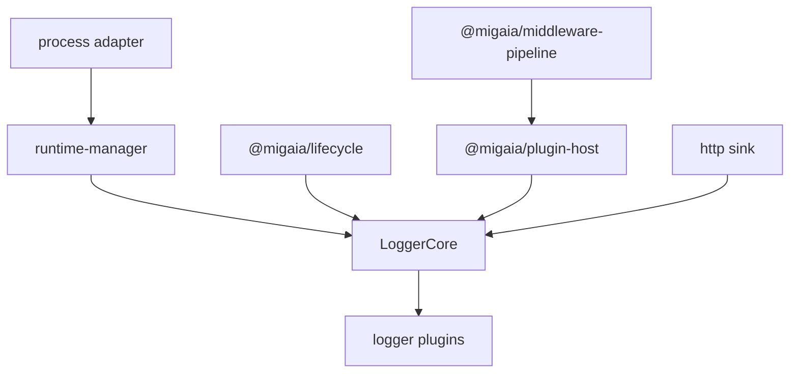
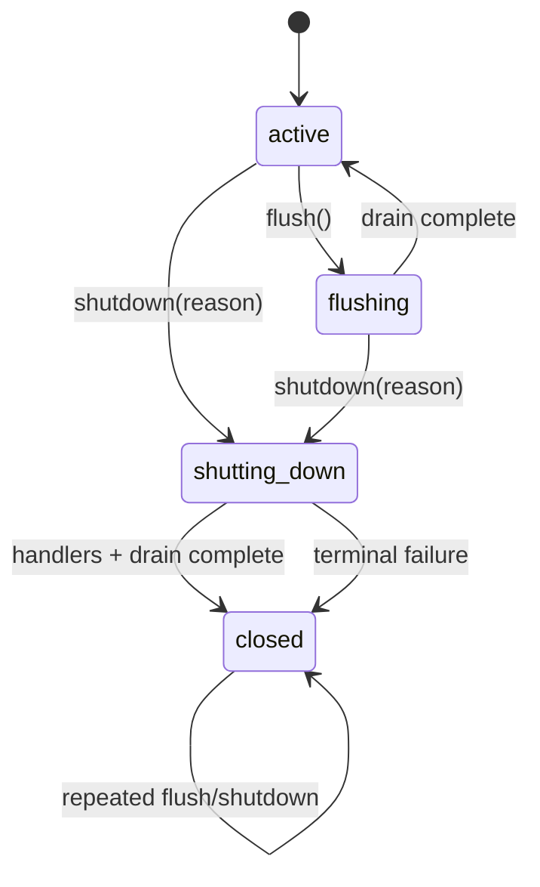

# SDD：Logger 生命周期与可靠性演进

## 0. 状态与闭合规则

- 状态：`verified`（2026-08-18；dirty worktree）。完整 package、browser、direct-consumer 与 Playwright E2E 门禁均已闭合。
- 范围：`packages/logger` 的核心、runtime adapter、logger plugins、生命周期和异步可靠性契约。
- 所有者：`packages/logger`。
- 直接依赖：`@migaia/plugin-host`、`@migaia/lifecycle` 的公开契约；`@migaia/middleware-pipeline` 由 `@migaia/plugin-host` 传递提供，logger 不直接依赖或拥有这些包的状态机。
- 受影响包：`@migaia/logger`；直接消费者 gate 为 logger package、logger E2E 及使用 logger runtime adapter 的消费者。
- 前置文档：`docs/plugin-host/runtime-neutral-foundation.sdd.md`、`docs/contracts/error-codes.md`、`docs/contracts/runtime-neutrality.sdd.md`。
- 关联文档：`docs/review/foundation-runtime-adversarial-audit.sdd.md`。AF-66/AF-67 在总审计中仍须由总审计 owner 更新证据，不能以本文件的局部证据替代。
- 明确排除：Store 包、Store SDD、Store 迁移和 Store 测试不在本文范围；Store 重构由其自身 SDD 管理。

闭合规则：本文沿 `pending → red → implemented → verified` 推进；`blocked` 只表示外部设计或环境阻断，`deferred` 必须有独立 owner 和目标文档。LG-R12/LG-R13/LG-R14/LG-R15/LG-R18/LG-R19/LG-R20/LG-R21/LG-R22/LG-R23/LG-R24/LG-R29/LG-R30/LG-R31/LG-R32/LG-R33/LG-R34、LG-R10/LG-R11 以及 AF-66/AF-67/AF-79/AF-80/AF-126/AF-128/AF-129 当前最多为 `implemented-unverified`，不得写成 `verified`。每条需求必须有测试 case，每个测试 case 必须反向映射到需求或设计条款；历史测试计数只作为历史证据，不作为当前闭合证明。

## 1. 目标与范围

### 1.1 目标

`@migaia/logger` 是薄核心加插件的日志管线。本文固定以下目标：

1. `LoggerCore` 只协调 entry、pipeline、sink、hook、flush、shutdown 和 logger 组合，不复制 lifecycle、pipeline 或 plugin-host 状态机。
2. Runtime manager 只提供宿主能力；Process plugin 只适配进程事件，不复制一套 shutdown 状态机。
3. 所有异步输出、hook、forward 和 plugin dispose 都进入可观察 drain 集合。
4. `flush()`、`shutdown()` 的重复和并发调用具有明确的 Promise identity、deadline、失败和终态语义。
5. pipeline 的可变 entry 与 sink 的提交快照边界明确。
6. Logger 与 PluginHost 使用同一个 scheduler snapshot 和同一个 time domain（AF-66）。
7. failure hook、console/write 和 pending cleanup 是终端 containment 边界，不产生新的 unhandled rejection（AF-67）。
8. shutdown handler 保持受控 admission；handler 产生的 work 在 shared deadline 内完成最终 drain，PluginHost disposer 开始前关闭 normal dispatch，禁止 disposer-era late work。
9. logger 每个公开 error code 都有真实触发路径的 native type、source、code 与 cause/errors 可达性证据；仅诊断码验证真实诊断 emission。
10. ProcessPlugin 最终卸载清理逐项继续、按发生顺序聚合失败，并在 guaranteed finalization 中清空静态 terminal state，允许后续重新安装（AF-126）。
11. HTTP scheduler task cancel 失败不得遗留 backoff/request/flush pending；request listener 必须移除，cleanup error 按 logger failure policy 可观察且 primary 保持可达（AF-128）。
12. ProcessPlugin、BatchPlugin 的 shutdown/debounce/interval timers 只使用 core 注入的 lifecycle scheduler snapshot；同步 callback、无效 task 和 cancel failure 不得破坏 settlement、receiver 或 time domain（AF-129）。
13. BatchPlugin shared factory owns every batcher it creates; final uninstall cancels every scheduled task, drops buffered items by contract, makes retained factories/batchers inert, and prevents late callbacks from invoking the removed callback or `core.defer`（Round20）。
14. Final plugin uninstall and process shutdown cleanup use distinct logger error codes/texts; primary and cleanup error identity/order remain reachable, and install rollback code is reserved for install rollback（Round20）。
15. ProcessPlugin admits multiple cores only when their scheduler snapshots carry the same retained source time-domain token; identical injected scheduler sources are accepted despite separate snapshots, while a different source is rejected before core registration with `PLUGIN_CONFIG_CONFLICT`（Round21）。
16. ProcessPlugin conservatively owns every attempted `runtimeProcess.on` registration before invocation; stored-then-throw rollback removes each attempted listener once, preserves primary plus rollback failures, and leaves runtime state reinstallable（Round26）。
17. HTTP request/backoff, Process shutdown/flush, and Batch debounce scheduler callbacks retain returned armed tasks across synchronous callback execution and cancel each admitted handle exactly once, without late work or successful-POST retry regression（Round26）。
18. ProcessPlugin final cleanup treats every thrown value as data: tagging a frozen/sealed Error may return an attachable logger wrapper with the original as `cause`, and tagging failure must never skip later cleanup; all cleanup items remain ordered and reachable while static runtime state resets。
19. Process runtime console/write reporters observe returned thenables exactly once, preserve thenable receiver and rejection identity during observation, and contain getter/invocation/rejection failures without reentrant process diagnostics or unhandled rejection。
20. Frozen/sealed cleanup fallback wrappers keep their newly constructed native stack and wrapper message/metadata, preserve native prototype/name, retain the exact original error as `cause`, and preserve nested aggregate error order without mutating the original stack。

### 1.2 范围内行为

- process plugin 的 install、rollback、uninstall、重装和 runtime listener 生命周期。
- before/after hook 的注册顺序、异步等待和错误观测。
- sink、batch、HTTP、extends graph 的 pending tracking、flush 和 shutdown。
- entry、meta、args、context 的所有权和 sink 提交边界。
- logger 自有错误码、错误文本和跨 package 错误 cause 可达性。

### 1.3 非目标

- 不改变 `Logger`、`level()`、`color()` 等主要基础调用方式。
- 不引入新的日志级别体系。
- 不把 logger 改造成全局 singleton。
- 不实现持久化离线队列、跨进程日志代理或 Store 集成。
- 不在 logger 内重新实现 lifecycle scope、generation、lease、scheduler 或 middleware execution algebra。

## 2. 现状与问题

### 2.1 当前架构

当前 logger 采用薄核心 + 插件架构：level、color、batch、http、process 等语义由插件提供；`@migaia/plugin-host` 负责安装、shared 能力、配置和资源撤销；runtime-manager 隔离 Node/Bun/浏览器宿主能力；`extends()` 通过 logger id 和 runtime path 防止循环。

核心只能依赖公开类型和原语；核心不得 import 具体插件实现。Process adapter 可以依赖 runtime manager，但不得把进程全局状态混入普通 logger 实例。

### 2.2 历史问题与保留契约

以下问题来自旧 SDD，保留为本轮审查的行为背景：

- Process plugin 的 shutdown 状态在首次 graceful shutdown 后不能安全复用；卸载后重新安装可能继承旧状态。
- `beforeExit` 对每个 core 启动独立 fire-and-forget flush，缺少 runtime 级去重和最终退出条件。
- HTTP 无 batch 路径把发送失败转成 resolved Promise，核心无法区分成功和失败。
- flush 的 pending、flusher、extends 之间缺少统一 drain 语义，可能在后续任务注册前提前返回。
- `ILogEntry` 的 readonly 不能保护嵌套对象、Date、Map/Set 或 sink 提交后的可见内容。
- `log(tag, message, ...args)` 通过最后一个对象推断 meta，console 参数和结构化字段语义混淆。
- HTTP 对所有 fetch 异常和非 2xx 统一 retry，缺少 4xx、429、5xx 和取消边界。

### 2.3 本轮强对抗项

| ID | 状态 | 问题 | 当前修复边界 |
| --- | --- | --- | --- |
| AF-66 | implemented-unverified | LoggerCore 之前可能把 scheduler 单独保存，而传给 PluginHost 的 hostOptions 使用 systemScheduler，形成两个时间域；scheduler method 也存在 TOCTOU 风险。 | 当前实现已在入口单次解析 scheduler，并把同一 snapshot 传给 PluginHost、logger 生命周期和 plugin core；完整 gate 未在本文迁移中重新闭合。 |
| AF-67 | implemented-unverified | failure hook、console/write 或 pending cleanup 自身失败可能制造未处理 rejection，或让业务失败链失去终端边界。 | 当前实现已增加 terminal containment 和可观测清理路径；完整 gate 与直接消费者证据仍需独立登记。 |
| AF-79 | implemented-unverified | logger scheduler admission failure 的 error owner 可能漂移到 PluginHost 或 systemScheduler，丢失 logger `INVALID_OPTION`/cause 归属。 | 当前实现已固定 logger-owned `INVALID_OPTION` 边界；完整 gate 与 Sol 复核仍待完成。 |
| AF-80 | implemented-unverified | continuation tracking 未严格区分 upstream failure、迟到 continuation 与重复 drain，可能重复报告、吞错或改变 primary。 | 当前实现已加入 exactly-once tracking；完整 gate 与 Sol 复核仍待完成。 |
| AF-126 | implemented-unverified | ProcessPlugin 最终卸载时 exit restoration 或 removeListener failure 可能短路后续清理，静态 terminal state 残留导致后续安装失效。 | 当前实现逐项继续清理、保留 primary/order、guaranteed reset；新增 LG-R20/LG-T19。 |
| AF-128 | implemented-unverified | HTTP scheduler task cancel 抛错可能跳过 listener removal 或令 backoff/request/flush Promise 永不 settle，并丢失 cleanup error。 | 当前实现以 settled guard + finally cleanup + logger-owned delivery retention 收口；新增 LG-R21/LG-T20。 |
| AF-129 | implemented-unverified | ProcessPlugin/BatchPlugin 仍可能直接依赖宿主 timers，且同步 scheduler callback、invalid task、cancel failure 会破坏 timer state 或 time domain。 | 当前实现统一使用 core scheduler snapshot；新增 LG-R22/LG-T21～LG-T23。 |
| LG-R27 | implemented-unverified | Logger constructor 先安装 plugins，再读取 `options.on`；hostile getter/Object.entries proxy 抛错会泄漏 ProcessPlugin listener 和 core-owned resources。 | 先 snapshot/admit public options；admission 失败以 logger `INVALID_OPTION`/native `TypeError` 保留原始 cause，插件安装前不产生副作用；新增 LG-T30。 |
| LG-R28 | implemented-unverified | HTTP send 可向已 abort 且不 replay 的 shutdown signal 注册 listener，随后创建 live request controller 并启动 POST。 | registration 后重新检查 signal/current logger state，abort fresh controller 或跳过 fetch；delivery 必须 settle、清理 timer/listener、terminal 后不再工作；新增 LG-T31，保留 AF-180 successful POST no-retry。 |
| LG-R29 | implemented-unverified | HTTP send/request-backoff 的 `addEventListener` 可能先存储 listener 或先调用 callback 再抛错；registration ownership 若在调用返回后才发布，会泄漏 listener、request controller 或 retry。 | signal 存在即预先拥有一次 cleanup；request registration failure 先 abort fresh request controller，remove 最多一次；callback-then-throw 不覆盖 registration primary；cleanup failure 均可达/可报告，不 retry 未提交请求；新增 LG-T32～LG-T37。 |
| LG-R30 | implemented-unverified | ProcessPlugin 的 `runtimeProcess.on` 可能先存储 listener 再抛错；仅在调用成功后记录 listener 会使构造失败泄漏 runtime listener，rollback 也可能短路。 | 每个 `on` 调用前先登记 attempted listener；失败时逆序 remove 每个 attempted listener 恰好一次，保留 install primary 与 rollback `AggregateError.errors`，finally 重置静态 ownership；新增 LG-T44/LG-T45。 |
| LG-R31 | implemented-unverified | scheduler callback 可在 `schedule()` 返回前同步执行；HTTP、Process、Batch 若仅 callback 未触发时保存 handle，会泄漏独立 armed task、重复 cleanup、挂起 backoff 或允许迟到工作。 | 每条路径跨越 `schedule()` return boundary 保留 returned task；callback/settlement 后 cancel 恰好一次，schedule/callback/task getter/cancel failures 按 primary→cleanup 顺序可达，Batch/Process late callback inert；新增 LG-T38～LG-T43、LG-T46/LG-T47。 |
| LG-R34 | implemented-unverified | Frozen/sealed cleanup wrapper 复制原始 `stack` 会覆盖 wrapper 自身构造栈，违反错误链契约并掩盖 wrapper 的 native message/metadata；嵌套 AggregateError 还需保留原始顺序。 | 删除 stack overwrite；wrapper 保留 native prototype/name/message/source/code 与非空 own stack，exact original 只经 `cause` 可达，AggregateError.errors 保持顺序；新增 LG-T51。 |

AF-60 的历史“Lifecycle scheduler、PluginHost、Resource、Serialize 全部已快照”的笼统闭合声明不作为 logger 证据；本文件只承认 AF-66 这一 logger-specific 条款。

## 3. 架构裁定与依赖方向

### 3.1 所有权

- lifecycle 拥有 scheduler/task/abort/deadline 原语；logger 只注入并保存其 snapshot。
- plugin-host 拥有 plugin admission、Readonly config、disposal 和 generator pipeline；logger 不复制这些状态机。
- middleware-pipeline 拥有 stage/downstream 的执行代数和错误组合；logger 不重新组合 AggregateError。
- logger 拥有 entry 提交边界、logger graph drain、failure policy 和 process adapter 的 logger-facing 协调。
- runtime-manager 拥有宿主 process、console、write、randomUUID、defer 等能力的隔离。

### 3.2 依赖方向

runtime-neutral foundation → plugin-host/lifecycle/middleware → logger → logger plugins/直接消费者。禁止 foundation 反向依赖 logger、DOM、Store、Node 具体 API 或某个插件实现。logger core 不直接调用 process、fetch、console 的具体全局对象。

### 3.3 复用与拒绝的重复路径

- 复用 lifecycle 的 `boundedWait`、scheduler snapshot、错误 cause 规则和 abort 语义。
- 复用 plugin-host 的 admission snapshot、disposer 记录和配置 ownership。
- 复用 middleware-pipeline 的 canonical halt/continue signal 和唯一双失败组合 owner。
- 拒绝在 logger 内新增 scheduler validator、lifecycle scope、pending counter、generation token 或 middleware sentinel。
- Process plugin 不是第二个 lifecycle manager；其 runtime 状态只覆盖进程事件 listener 和 active core registry。

## 4. 公开契约/核心设计

### 4.1 Logger lifecycle state machine

- `flush()` 并发调用返回同一个 in-flight Promise。
- `shutdown()` 并发调用复用同一个 Promise，第一次 reason 生效。
- shutdown 失败也进入 terminal；重复调用复用同一个 rejected Promise，不重新使用已关闭的 host。
- shutdown handler 运行期间 normal dispatch 仍可 admission；handler 完成后执行 shared-deadline final drain，再关闭 normal dispatch，最后才进入 `PluginHost.dispose()`。Plugin disposer 中的 log/raw 被拒绝，不得新增 `#pending`。
- `closed` 后新日志不执行 sink；按 logger failure policy 处理，而不是把 entry 投递给已 dispose 的 host。
- 所有 plugin dispose 在 core 到达 `closed` 前完成或进入明确的 terminal failure。

### 4.2 统一异步任务追踪

内部 task registry 记录 `defer`、`sink`、`hook`、`flush`、`forward` 和 plugin dispose 的任务来源与失败信息。drain 按“注册当前任务 → 等待当前批次 → 重新观察新增任务”循环，使用一份绝对 deadline；超时放弃等待但必须先观测 task，不能取消用户 task，也不能制造 unhandled rejection。

### 4.3 Process runtime adapter

Process plugin 的 runtime state 分成 binding、listener registry、active cores 和 runtime shutdown Promise。active cores 归零时清理 shutting-down 标志、listener 和 runtime 引用；配置冲突在加入 active core 集合前失败。部分安装失败必须 rollback 已安装 listener，主安装错误保持 primary，rollback 错误经 `cause` 或 `AggregateError.errors` 可达。

`beforeExit` 只调用 runtime 级共享 flush Promise；不得为每个 core 启动互不关联的 fire-and-forget flush。

Process plugin/logger installation during an in-progress runtime shutdown is rejected with
`RUNTIME_SHUTTING_DOWN`; callers must wait for the runtime shutdown to settle or install without the
process plugin. This is an admission failure, not a recoverable process-log delivery attempt.

When `interceptProcessExit` is enabled, installation snapshots the exact `runtimeProcess.exit` function
and its receiver before replacing the property. The wrapper captures both snapshots, waits on the
shared flush single-flight/deadline, then invokes that exact pair with the caller's exit code; it never
looks up the mutable `runtimeProcess.exit` property later. Final uninstall restores the same function
identity and clears the interception state, so a subsequent install snapshots the restored function.

Final uninstall cleanup is an ordered best-effort phase. Exit restoration and every stored listener
removal are attempted even when a prior thrown Error is frozen/sealed, a primitive, or another
non-Error value. `tagLoggerError` keeps an extensible Error identity when possible; when metadata
attachment fails it creates an attachable native wrapper with logger `source`/`code`, native
prototype/name/message, and a non-empty own stack generated at wrapper construction. It never
overwrites that wrapper stack with the original stack; the exact original object remains reachable
through `cause`, and a wrapped AggregateError retains its nested `errors` order. The outer cleanup
error retains cleanup order in `AggregateError.errors`; guaranteed finalization resets all static
runtime ownership before the cleanup error is surfaced.

### 4.7 Batch shared capability ownership

`BatchPlugin.shared()` owns a registry of every batcher created from its factory. Uninstall closes
factory admission before cleanup, attempts cancellation for every live debounce/scheduled task, and
then drops buffered items; uninstall does not implicitly flush user callbacks. A retained factory or
batcher from the removed registration is inert, and a late scheduler callback returns before calling
the removed `onBatch` or `core.defer`. Async full-batch dispatch records are settled during drop so
an in-progress batch flush cannot remain pending. Synchronous and asynchronous `onBatch` failures
are observed through logger failure policy, while cancel failures are aggregated as
`PLUGIN_UNINSTALL_CLEANUP_FAILED` with the original error identity preserved.

### 4.8 Cleanup error ownership

`PLUGIN_UNINSTALL_CLEANUP_FAILED` identifies final plugin cleanup after all uninstall actions were
attempted. `PLUGIN_SHUTDOWN_CLEANUP_FAILED` identifies process shutdown cleanup, including timeout
task cancellation and captured-exit failure. Neither code may be used for install rollback; the
rollback code remains limited to the primary install failure plus rollback failures.

Process runtime failure reporting is a terminal observer. `console.error` or `write` is invoked once;
if its void-typed result is a thenable, logger reads `.then` once, assimilates it with the original
thenable receiver, and observes fulfillment/rejection without retrying the reporter or re-entering a
process signal path. Hostile getter, invocation, and rejection failures are contained and cannot create
an unhandled rejection.

### 4.4 Entry boundary 与结构化字段

pipeline 阶段允许修改内部工作 entry；进入 sink 前创建提交快照。至少复制 `context`、`args`、`data` 的顶层容器，并明确 Date、Error.raw、Map/Set 和嵌套用户对象的所有权；不以“readonly”字样暗示未实现的深冻结。

`log(tag, message, ...args)` 保持 console-style 参数；结构化日志走显式入口，例如 `dispatchRaw({ tag, message, meta })`。JSON/HTTP sink 使用 `entry.meta`，console sink 使用 `entry.args`；不再把最后一个普通对象隐式当作唯一 meta 来源。

### 4.5 HTTP 发送策略

- sink 返回原始发送 Promise，失败必须进入 core failure policy。
- 默认只 retry 网络错误、429 和 5xx；4xx（429 除外）直接失败。
- `retries` 必须是有限非负整数，插件构造阶段拒绝非法值。
- 支持 `AbortSignal`；shutdown/timeout 的取消策略由 core/plugin 明确传入。
- `Retry-After` 优先于固定指数退避。

Round26 scheduler ownership：HTTP request timeout and retry backoff, Process shutdown/flush timeout, and Batch debounce use a local `attempted → returned-handle → cancel-once` boundary. The callback may record settlement or failure synchronously, but settlement remains cleanup-safe until `schedule()` returns. A returned handle is admitted even after callback execution and is cancelled exactly once; schedule/callback/task-accessor/cancel failures preserve first primary and append cleanup failures in observation order. A callback that runs before `schedule()` throws has no recoverable handle and therefore must not invent late work or retry an uncommitted POST.

Process listener ownership uses the same admission rule at the host boundary: each attempted `runtimeProcess.on()` registration is recorded before invocation, so stored-then-throw is removable. Rollback traverses attempted registrations in reverse order exactly once, preserves install primary before rollback failures, and resets static ownership in `finally` before a later reinstall.

### 4.6 新增与历史稳定需求登记

旧 ID 不重编号；本轮新增 ID 只追加。

| ID | 契约 | 状态 | 关联审计 |
| --- | --- | --- | --- |
| LG-R6-1 | 异步 before hook 完成后才允许 sink 观察 entry | implemented-unverified | 历史本轮 |
| LG-R6-2 | process 配置冲突不得污染 active core 集合 | implemented-unverified | 历史本轮 |
| LG-R6-3 | shutdown 失败后重复调用复用同一个 rejected Promise | implemented-unverified | 历史本轮 |
| LG-R6-4 | HTTP 状态失败携带 `DELIVERY_FAILED` | implemented-unverified | 历史本轮 |
| LG-R6-5 | 生命周期 deadline 错误携带 `LIFECYCLE_DEADLINE` | implemented-unverified | 历史本轮 |
| LG-R6-6 | logger 稳定错误文本集中由 `error-text.ts` 所有 | implemented-unverified | 历史本轮 |
| LG-R6-7 | generator pipeline 的 halt/continue signal 在 host 与 runner 间保持同一 Symbol identity | implemented-unverified | 历史本轮 |
| LG-R6-8 | HTTP retries 是有限非负整数，非法值在构造阶段拒绝 | implemented-unverified | 历史本轮 |
| LG-R6-9 | process listener 部分安装失败时清理已注册 listener，并允许后续安装 | implemented-unverified | 历史本轮 |
| LG-R10 | hook、sink、pipeline 及插件安装结果的 then getter 每个边界只读一次，并以原对象为 receiver assimilation | implemented-unverified | AF-39 / LG-R10 |
| LG-R11 | ProcessPlugin rollback 异常不得覆盖主安装异常；主异常与全部 rollback 异常都可追踪 | implemented-unverified | AF-44 / AF-53 |
| LG-R12 | Logger 与 PluginHost 共享同一个 scheduler snapshot/time domain；options、scheduler method、task cancel accessor 按 admission 单读并保留 receiver | implemented-unverified | AF-66 |
| LG-R13 | failure hook、console/write 和 pending cleanup 是终端 containment；同步抛、异步拒绝和 hostile thenable 不得产生 unhandled rejection | implemented-unverified | AF-67 |
| LG-R14 | logger scheduler admission 错误由 logger 拥有 `INVALID_OPTION`；scheduler getter/method failure 保留原始 cause，不被 PluginHost 或 systemScheduler 改写 | implemented-unverified | AF-79 |
| LG-R15 | continuation/forward tracking 观察每个上游失败 exactly-once；上游 failure 不因迟到 continuation、重复 drain 或 reporter failure 被吞掉、重复报告或改变 primary | implemented-unverified | AF-80 |
| LG-R16 | shutdown handler-era work 在 shared deadline 内完成 final drain；PluginHost disposer 开始前关闭 normal dispatch，disposer-era log 不进入 sink、已 disposed host 或 `#pending`，并保持 Promise single-flight、deadline 和 terminal failure identity | implemented-unverified | Sol late-work finding |
| LG-R17 | 14 个 logger error code 均由真实 public trigger 覆盖 native type、`source`、`code` 与 cause/errors identity；`HOOK_FAILED` 以真实 diagnostic emission 覆盖 | implemented-unverified | Sol error-code contract finding |
| LG-R18 | Runtime fetch throws are finalized after the configured attempts (including retries `0`) as logger-owned `DELIVERY_FAILED`; the original transport error remains reachable through `cause`, already-tagged delivery errors keep native type/identity, and one dispatch invokes one failure hook | implemented-unverified | Luna transport ownership finding |
| LG-R19 | Intercepted `process.exit` snapshots exact function identity and receiver before replacement; wrapper preserves exit code, shared flush deadline and single-flight, while uninstall restores exact identity without a late `exit` lookup or Function.prototype bind/call/apply | implemented-unverified | Luna process-exit recursion finding |
| LG-R20 | AF-126：ProcessPlugin final uninstall attempts exit restoration and every listener removal in order, aggregates primary and all cleanup failures, resets all static terminal state in guaranteed finalization, and permits later reinstall | implemented-unverified | Round18 AF-126 |
| LG-R21 | AF-128：HTTP request/backoff cleanup always settles the owning Promise and removes abort listeners even when scheduler task cancel throws; cleanup errors remain observable without replacing the transport primary | implemented-unverified | Round18 AF-128 |
| LG-R22 | AF-129：ProcessPlugin shutdown timers and BatchPlugin debounce/interval timers use the core lifecycle scheduler snapshot exclusively; synchronous callbacks, invalid task handles, cancel failures, receiver, and clock domain remain safe | implemented-unverified | Round18 AF-129 |
| LG-R23 | BatchPlugin owns every created batcher; uninstall cancels every scheduled task, drops buffered items, settles dropped async dispatch records, blocks late callback/`core.defer` activity, contains callback failure, and isolates reinstallation | implemented-unverified | Round20 batch uninstall finding |
| LG-R24 | Final uninstall and process shutdown/cancel/exit cleanup use distinct canonical logger codes/texts; primary and cleanup errors retain native type, identity, and order; `PROCESS_INSTALL_ROLLBACK_FAILED` remains install-only | implemented-unverified | Round20 cleanup-code finding |
| LG-R25 | ProcessPlugin global ownership requires one retained scheduler time-domain token: separate snapshots from one injected source are accepted, different sources reject with `PLUGIN_CONFIG_CONFLICT` before core addition, and final uninstall permits ownership transfer | implemented-unverified | Round21 scheduler-domain mismatch |
| LG-R26 | Once `runtimeFetch` resolves a response, request-side effects are committed: timer/listener cleanup failures are contained exactly once through logger delivery policy, never change response/status retry decisions or duplicate POSTs, preserve status-primary plus cleanup identity/order, and remain settled across cancellation/shutdown | implemented-unverified | Round23 response-commit cleanup finding |
| LG-R27 | Constructor snapshots/admit all public option reads, including `on` enumeration and plugin collection, before resource-owning plugin installation; hostile admission errors are logger `INVALID_OPTION` native `TypeError`s with original cause and no leaked listener/core resource; later process reinstall remains usable | implemented-unverified | Round24 confirmed HIGH construction leak |
| LG-R28 | HTTP request admission rechecks shutdown signal after listener registration and before scheduling/fetch; an already-aborted/non-replaying signal aborts the fresh controller or skips fetch, settles pending delivery, removes listeners/timers, and cannot create terminal-era work; resolved POST remains no-retry | implemented-unverified | Round24 confirmed HIGH shutdown race |
| LG-R29 | HTTP send/request-backoff owns partial abort-listener registration before the external call; callback-then-throw and stored-then-throw preserve registration primary, remove once, abort fresh request state, and prevent retry of an unsubmitted POST | implemented-unverified | Round25 confirmed HIGH partial-registration leak |
| LG-R30 | ProcessPlugin owns every attempted runtime listener registration before `on()` invocation; rollback removes each attempted listener once, preserves primary plus rollback failures, resets static state, and permits reinstall/uninstall with zero listeners | implemented-unverified | Round26 confirmed HIGH runtime listener leak |
| LG-R31 | HTTP request/backoff, Process shutdown/flush, and Batch debounce retain returned scheduler handles across synchronous callback execution and cancel each admitted task exactly once; schedule/callback/task/cancel failures remain ordered and no late work or successful-POST retry regression occurs | implemented-unverified | Round26 confirmed HIGH synchronous scheduler task leak |
| LG-R32 | ProcessPlugin final uninstall continues after frozen/sealed Error tagging failure and arbitrary primitive/non-Error throws; every cleanup action is attempted in registration order, cleanup wrappers carry logger code with original `cause`, `AggregateError.errors` preserves order, and static runtime state resets for reinstall | implemented-unverified | Round27 confirmed HIGH final-cleanup tagging short-circuit |
| LG-R33 | Process runtime `console.error`/`write` reporter results are observed as hostile thenables with one `.then` read and original receiver; getter/invocation/rejection failures are contained after one diagnostic attempt with no reentrant process signal or unhandled rejection | implemented-unverified | Round27 confirmed HIGH async runtime reporter escape |

## 5. 生命周期与错误语义

### 5.1 生命周期与并发

`active → flushing → active` 只表示一次 drain；`active/flushing → shutting_down → closed` 是终态路径。close/shutdown 期间不得重新接受会进入已释放 host 的工作。所有 in-flight Promise 在状态发布后立即保存，保证重复、并发和 reentrant 调用的 identity。

### 5.2 Scheduler 与 deadline

Logger 入口读取 `options.scheduler` 一次；显式非 `undefined` 的非法值由 logger admission 以 logger-owned `INVALID_OPTION` 边界拒绝，不能静默退回 systemScheduler，也不能把 scheduler error owner 推给 PluginHost。随后由 lifecycle snapshot `now`、`schedule` 和 task `cancel`，每个 method 以原 receiver 执行。PluginHost dispose、logger flush、shutdown bounded wait 和 plugin core 必须使用同一 snapshot；不得跨两个时钟计算同一 shutdown deadline。ProcessPlugin 是 logger runtime 全局 owner：它比较 logger admission 为每个 snapshot 保留的源对象 time-domain token，而不比较 snapshot 方法闭包；同一注入源的独立 snapshot 属同一 domain，不同源必须在 core 加入前以 `PLUGIN_CONFIG_CONFLICT` 拒绝。

### 5.3 失败策略

- sink、hook、HTTP、flush、forward 和 plugin dispose 的业务错误必须保留原始对象，并带 logger source/code；不能用 resolved Promise 隐藏失败。
- 默认 logger policy 不把日志失败打穿业务调用栈，但必须调用 failure hook 或 diagnostic sink。
- failure hook 自身同步抛出或异步 reject 时，进入 terminal reporter containment；不能再次递归 failure hook。
- continuation/forward tracking 必须在注册、观察、清理三个边界各自 exactly-once；上游 failure 先固定为 primary，再观察迟到 continuation，不能因重复 drain 重复执行 sink/hook 或重复报告。
- console/write 是最后观察者，其同步抛错、异步 reject、then getter 抛错都被收容。
- cleanup 失败不得覆盖主 shutdown/install 错误；使用 `cause` 或 `AggregateError.errors` 保留全部 identity。

### 5.4 错误码与文本

跨 package 的错误遵守 `docs/contracts/error-codes.md`：错误保留 native error type、非空 stack、唯一 `(source, code)`，wrapper 不替换原错误，cause/errors 链在有限步内可达原始错误。Fallback wrapper 的 own stack 必须保持其构造栈，禁止从 `cause` 复制或覆盖；wrapper 的 native prototype/name/message/source/code 及 nested `AggregateError.errors` 顺序必须保持可断言。Logger 的 `INVALID_OPTION`、`DELIVERY_FAILED`、`LIFECYCLE_DEADLINE`、`PROCESS_INSTALL_ROLLBACK_FAILED`、`PLUGIN_UNINSTALL_CLEANUP_FAILED`、`PLUGIN_SHUTDOWN_CLEANUP_FAILED`、`HOOK_FAILED` 等码只在 `packages/logger/src/error-code.ts` 声明；稳定文本只由 `packages/logger/src/error-text.ts` 所有。任何公共错误文本变化必须同步 UT、USEGUIDE/README、registry 和跨包断言。

### 5.5 取消与迟到结果

shutdown/timeout 的 signal 先使当前 logger 状态不可逆，再调用可失败的外部 cancel/dispose。迟到的 sink、hook 或 forward 结果只能被观察、记录或释放，不能重新打开 logger、重置 deadline 或进入已关闭 host。

AF-126/128/129 的附加边界：ProcessPlugin final uninstall 先尝试 captured exit restoration，再按 listener registry 顺序逐项 remove；每一步失败都记录但不短路，finally 清空全部 static runtime state，AggregateError.errors 顺序为 primary followed by later cleanup failures，并以 `PLUGIN_UNINSTALL_CLEANUP_FAILED` 标识 final uninstall cleanup。HTTP request timer、retry backoff timer 与 abort listener 在同一 cleanup pass 中分别 settle、cancel/remove；cancel throw 进入 logger `DELIVERY_FAILED` 的 cause/errors 链，不得阻止 listener removal。ProcessPlugin shutdown timeout 与 BatchPlugin debounce timer 只从 `core.scheduler` snapshot schedule；scheduler callback 可同步执行，schedule 返回值由 lifecycle snapshot 验证，cancel throw 或 captured exit failure 使用 `PLUGIN_SHUTDOWN_CLEANUP_FAILED`，只能报告/保留，不能制造 unhandled rejection 或悬挂 Promise。BatchPlugin uninstall 先关闭 factory admission，再取消全部 task、drop buffer、settle dropped dispatch record；late callback 不得调用 removed callback 或 `core.defer`，reinstall 使用新 registry。

Round24 附加边界：Logger constructor 必须在任何 plugin install 前完成 scheduler、context、topic、business options、pipeline、plugin collection 和 constructor hook enumeration 的 admission snapshot；任何 getter、iterator 或 `Object.entries` proxy failure 都以 logger-owned `INVALID_OPTION`/native `TypeError` 抛出，原始异常保留在 `cause`，且不得留下 ProcessPlugin listener、core resource 或 static runtime ownership。HTTP `shutdownSignal.addEventListener()` 返回后必须再次读取当前 abort state；若 signal 已 abort 或 logger controller 已进入 terminal，fresh request controller 先同步 abort，fetch 不得启动；pending send 仍须经 `finally` 清理 listener/timer 并完成 settlement。该 guard 不得改变已 resolved response 的 commit/no-retry 规则。

Round25 附加边界：HTTP send/request-backoff 在调用 `shutdownSignal.addEventListener()` 前即视为 listener cleanup 可能已拥有；stored-then-throw 与 callback-then-throw 均必须保留 registration error 为 primary、request path abort fresh controller、执行恰好一次 remove，并让 `flush()`/`shutdown()` settlement 经过 logger failure policy 完成。remove throw 只能增加可达 cleanup failure，不得触发第二次 remove 或 retry；already-aborted signal、repeat sends 和 backoff registration failure 必须无 live listener/timer，且未提交 POST 不得因 registration failure 重试。

Round26 附加边界：ProcessPlugin 对每个 `runtimeProcess.on(event, listener)` 先发布本地 attempted-registration ownership，再调用宿主；stored-then-throw、callback-then-throw 或 accessor/invocation failure 都必须逆序 remove 每个 attempted listener 一次，rollback failure 追加在 install primary 后，且 finally 清空静态 runtime ownership，后续 reinstall/uninstall 无残留。HTTP request timeout、HTTP retry backoff、Process shutdown/flush timeout 与 Batch debounce 都必须在 scheduler callback 可能同步执行时先 capture callback outcome、再 admit returned task、最后 exactly-once cancel；schedule throw 或 task/cancel getter/call failure 不得制造 late work、悬挂 Promise 或覆盖既有 transport/status primary。已 resolved HTTP response 仍提交一次 POST，cleanup failure 不得转成 status retry。

## 6. 迁移与实施批次

每批遵循：`inventory → red test → contract/error registration → implementation → delete duplicate/compatibility path → docs/exports/dependencies → package gates → direct-consumer gates → repository gates → evidence`。

| 批次 | 内容 | 当前状态 |
| --- | --- | --- |
| B0 | 清点旧 lifecycle、process、sink、hook、entry 和 HTTP 路径；冻结旧 LG-R/LG-T ID | implemented-unverified |
| B1 | 先补 LG-T6-1～LG-T6-9、AF-66/67 对抗 case，再注册 LG-R12/LG-R13 与错误码 | implemented-unverified |
| B2 | LoggerCore 统一 lifecycle、task registry、Promise identity 和 deadline | implemented-unverified |
| B3 | Logger scheduler 单快照并传入 PluginHost；删除 logger/systemScheduler 双路径 | implemented-unverified |
| B4 | failure reporter terminal containment；删除未观测 `finally` 子 Promise | implemented-unverified |
| B8 | AF-79 scheduler error owner 与 AF-80 continuation/upstream failure exactly-once；新增 LG-R14/LG-R15 与 LG-T13/LG-T14 | implemented-unverified |
| B5 | Process adapter rollback、HTTP failure/retry、entry 提交快照和显式 meta | implemented-unverified |
| B9 | Process exit interception captures the original function/receiver before replacement; add recursion, receiver, code, flush single-flight, repeated install/uninstall regression evidence | implemented-unverified |
| B10 | AF-126/128/129：Process final-uninstall failure isolation, HTTP scheduler-cancel settlement, and core-scheduler timer migration；先 red case，再实现、删除宿主 timer 路径并完成 manual-scheduler evidence | implemented-unverified |
| B6 | 删除已被 canonical lifecycle/pipeline/plugin-host 取代的重复 helper；更新 exports、README、USEGUIDE 和 error registry | pending |
| B7 | package gates、logger E2E、直接消费者 gates、仓库 gates 与 dirty baseline evidence | pending |
| B11 | Round21：retain logger scheduler source-domain identity across lifecycle snapshots; reject mixed ProcessPlugin time domains before core registration; add two-core, cleanup, reinstall, and hostile-option evidence | implemented-unverified |
| B12 | Round23：response-commit HTTP cleanup classification；先验证成功 POST 不因 cancel/remove 失败重发，再验证 503 status retry 与 cleanup primary/order/no-unhandled | implemented-unverified |
| B13 | Round24：constructor public-option admission snapshot/rollback boundary 与 HTTP shutdown post-registration guard；先取得 LG-T30/LG-T31 red，再完成实现、package/direct-consumer gates 和 dirty-worktree evidence | implemented-unverified |
| B14 | Round25：HTTP abort-listener partial-registration ownership；先取得 LG-T32～LG-T37 red，再完成 conservative cleanup、primary/cleanup identity、no-retry/no-live-resource evidence | implemented-unverified |
| B15 | Round26：Process runtime listener attempted-registration ownership 与 HTTP/Process/Batch synchronous scheduler callback-before-handle ownership；先取得 LG-T38～LG-T47 red，再完成 rollback/cancel ordering、reinstall/no-late-work evidence | implemented-unverified |
| B16 | Round27：Process final cleanup arbitrary-throw/tagging containment 与 runtime console/write thenable observation；先取得 LG-T48～LG-T50 red，再完成 ordered cleanup/wrapper identity、single reporter attempt、no-unhandled/no-reentrant evidence | implemented-unverified |
| B17 | Round28：修复 frozen/sealed fallback wrapper stack ownership；先取得 LG-T51 red，再删除 stack overwrite 并完成 wrapper native fields、exact cause、nested aggregate order evidence | implemented-unverified |

任何批次失败都不得把局部测试通过升级为 `verified`；兼容路径只有在对应行为迁移和删除证据同时存在时才能移除。

## 7. 测试与验收矩阵

### 7.1 历史稳定 case

| ID | 场景 | 明确断言 | 关联需求 |
| --- | --- | --- | --- |
| LG-T6-1 | 异步 before hook | hook 完成前 sink 不观察 entry；按注册顺序执行 | LG-R6-1 |
| LG-T6-2 | process 配置冲突 | 失败 logger 不进入 active core 集合，先前 logger 可正常 shutdown | LG-R6-2 |
| LG-T6-3 | shutdown 失败重入 | 失败后再次 shutdown 返回同一 rejected Promise，实例不重新接受 sink | LG-R6-3 |
| LG-T6-4 | HTTP 状态失败 | fetch/HTTP 失败保留 `DELIVERY_FAILED` 并进入 failure policy | LG-R6-4 |
| LG-T6-5 | lifecycle deadline | deadline 超时错误带 `LIFECYCLE_DEADLINE`，原任务仍被观测 | LG-R6-5 |
| LG-T6-6 | 稳定文本所有权 | logger 生产源码不散落维护错误文本，error-text 为唯一所有者 | LG-R6-6 |
| LG-T6-7 | generator identity | host 与 runner 使用同一 halt/continue Symbol，信号不因 re-export 变形 | LG-R6-7 |
| LG-T6-8 | retries admission | `-1`、`Infinity` 等非法 retries 在插件构造阶段以 `INVALID_RETRY_COUNT` 拒绝 | LG-R6-8 |
| LG-T6-9 | process rollback | 部分安装失败时清除已注册 listener；rollback 失败不覆盖主异常，全部错误可达 | LG-R6-9、LG-R11 |

### 7.2 AF-66/AF-67 与新增 case

| ID | 场景 | 明确断言 | 状态 | 位置 |
| --- | --- | --- | --- | --- |
| LG-T10 | shared scheduler/time domain | options.scheduler、now/schedule accessor 各单读；PluginHost disposer、Logger lifecycle、plugin core 收到同一 snapshot；调用 receiver 保持原对象；shutdown 使用同一时钟 | implemented-unverified | `packages/logger/test/hardening-regressions.spec.ts` 的 AF-66 describe |
| LG-T11 | terminal reporter containment | sync failure hook、async failure hook、console.error、runtime.write、sink rejection 均被收容；flush resolve；进程无 unhandled rejection | implemented-unverified | `packages/logger/test/hardening-regressions.spec.ts` 的 AF-67 describe |
| LG-T12 | hostile thenable admission | then getter 只读一次；原 thenable 为 receiver；getter/调用同步抛和异步 reject 都保持原错误 identity、exactly-once diagnostic 且无 unhandled rejection | implemented-unverified | `packages/logger/test/thenable-boundaries.spec.ts`（17 cases） |
| LG-T13 | scheduler error owner | logger scheduler option/getter/method 失败在 logger admission 边界带 logger `INVALID_OPTION`，原始异常保持 `cause`；不得退回 systemScheduler 或冒用 PluginHost owner | implemented-unverified | `packages/logger/test/hardening-regressions.spec.ts` |
| LG-T14 | continuation/upstream failure exactly-once | 上游 sink/hook/forward failure 只观察、报告和清理一次；迟到 continuation 与重复 drain 不重复执行或重复报告；reporter failure 不覆盖 primary 且无 unhandled rejection | implemented-unverified | `packages/logger/test/phase-hook-tracking.spec.ts` |
| LG-T15 | shutdown dispatch admission | controlled async sink 阻止 shutdown 提前 resolve；shutdown handler-era work 可 drain；plugin disposer 的 log 不进入 sink、不新增 late pending；重复 shutdown 返回同一 Promise；无 unhandled rejection | implemented-unverified | `packages/logger/test/hardening-regressions.spec.ts` |
| LG-T16 | logger error-code semantic matrix | 12 个历史真实触发路径分别断言 native type、logger `source`、正确 `code`、cause 或 `AggregateError.errors` identity；`HOOK_FAILED` 断言真实 reporter diagnostic | implemented-unverified | `packages/logger/test/error-code.test.ts` |
| LG-T17 | runtimeFetch transport exhaustion | retries `0` calls runtimeFetch once; retries `2` calls it three times; each dispatch reports one `sink` failure, source/code are logger-owned, original transport error is `cause`, and an already-tagged delivery error is not double-wrapped | implemented-unverified | `packages/logger/test/error-code.test.ts` |
| LG-T18 | intercepted process exit identity/receiver and reinstallation | fake process exit is intercepted once without recursion; flush runs once before the captured original receives the caller's code with the fake process as receiver; final uninstall restores exact function identity, and a second install/reinstall repeats the contract | implemented-unverified | `packages/logger/logger.test.ts` |
| LG-T19 | AF-126 final process uninstall multi-failure | exit restoration failure does not stop any listener removal; AggregateError preserves cleanup primary/order; static runtime state resets and a later intercepted install/uninstall succeeds | implemented-unverified | `packages/logger/test/hardening-regressions.spec.ts` |
| LG-T20 | AF-128 HTTP task cancel failure | request timer cancel throw still settles `flush()`, preserves `DELIVERY_FAILED` with cleanup `cause`, removes request listener, invokes one failure path, and produces no unhandled rejection | implemented-unverified | `packages/logger/test/hardening-regressions.spec.ts` |
| LG-T21 | AF-129 ProcessPlugin manual scheduler | process `beforeExit` timeout is driven by injected scheduler, uses its receiver/clock, and does not call global timer APIs | implemented-unverified | `packages/logger/test/hardening-regressions.spec.ts` |
| LG-T22 | AF-129 BatchPlugin manual scheduler | debounce timer is driven by the same core scheduler, synchronous callback does not leave a phantom timer, and flush settles after cancel/validation boundaries | implemented-unverified | `packages/logger/test/hardening-regressions.spec.ts` |
| LG-T23 | AF-129 HTTP manual scheduler | retry backoff and request timing advance only through the core scheduler; request attempt order and Promise settlement remain deterministic | implemented-unverified | `packages/logger/test/hardening-regressions.spec.ts` |
| LG-T24 | BatchPlugin final uninstall isolation | every batcher task is cancelled; cancel failure is logger-tagged; buffered items drop; late timer/factory calls do not invoke callback or `core.defer`; reinstall gets isolated state | implemented-unverified | `packages/logger/test/hardening-regressions.spec.ts` |
| LG-T25 | Batch callback containment | synchronous `onBatch` throw does not escape `push()` or create an unhandled rejection; original error reaches logger failure policy | implemented-unverified | `packages/logger/test/hardening-regressions.spec.ts` |
| LG-T26 | cleanup code phase ownership | final uninstall emits `PLUGIN_UNINSTALL_CLEANUP_FAILED`; graceful shutdown timer-cancel/exit failures emit `PLUGIN_SHUTDOWN_CLEANUP_FAILED`; neither path emits install rollback code and native errors/order remain reachable | implemented-unverified | `packages/logger/test/error-code.test.ts` |
| LG-T27 | ProcessPlugin scheduler-domain admission | two cores using one injected scheduler source create separate lifecycle snapshots but share one retained domain token and are accepted; a different manual scheduler is rejected with `PLUGIN_CONFIG_CONFLICT` before listener/core addition; first core remains usable; final uninstall allows second-source reinstall; scheduler option getter is read once | implemented-unverified | `packages/logger/test/hardening-regressions.spec.ts` |
| LG-T28 | HTTP successful response plus request cleanup failures | with `retries > 0`, a successful response plus timer cancel and abort-listener removal failures calls `fetch` once, reports one `DELIVERY_FAILED` failure with cleanup errors in cancel-then-remove order, and produces no unhandled rejection | implemented-unverified | `packages/logger/test/hardening-regressions.spec.ts` Round23 |
| LG-T29 | HTTP retryable status plus request cleanup failures | a 503 response still receives only its configured status retry; exhausted delivery retains 503 as aggregate primary followed by cancel/remove cleanup errors, reports once, and produces no unhandled rejection | implemented-unverified | `packages/logger/test/hardening-regressions.spec.ts` Round23 |
| LG-T30 | Round24 constructor hostile option admission | `options.on` getter and `Object.entries` proxy failures are thrown as logger `INVALID_OPTION` native `TypeError` with original cause before ProcessPlugin/listener/core resources install; failed construction leaks nothing and a later process install/uninstall succeeds | implemented-unverified | `packages/logger/test/round24.spec.ts` |
| LG-T31 | Round24 HTTP shutdown signal race | after shutdown abort, a non-replaying signal cannot produce a fresh live request: request controller is aborted or fetch is skipped, no timeout/listener remains, pending delivery and terminal flush settle, and resolved POST no-retry behavior remains covered by LG-T28 | implemented-unverified | `packages/logger/test/round24.spec.ts` |
| LG-T32 | Round25 stored-then-throw registration | listener retained before registration throw is removed exactly once; request controller is aborted; no timer/fetch/retry remains; primary registration error stays in `DELIVERY_FAILED`; flush/shutdown settle without unhandled rejection | implemented-unverified | `packages/logger/test/round25.spec.ts` |
| LG-T33 | Round25 callback-then-throw registration | callback-triggered request abort followed by registration throw preserves thrown registration error as primary, removes listener exactly once, skips POST/timer/retry, and settles shutdown | implemented-unverified | `packages/logger/test/round25.spec.ts` |
| LG-T34 | Round25 remove failure | remove throw is attempted once; registration primary remains first and cleanup error remains second in `AggregateError.errors`; no listener retry, POST retry, or unhandled rejection occurs | implemented-unverified | `packages/logger/test/round25.spec.ts` |
| LG-T35 | Round25 already-aborted signal | non-replaying already-aborted signal aborts fresh request controller after registration, skips fetch/timer, removes listener once, and lets flush/shutdown settle | implemented-unverified | `packages/logger/test/round25.spec.ts` |
| LG-T36 | Round25 repeat sends | repeated sends each own and remove one listener, leave no live listener/timer, invoke no POST, and report each registration failure without retry | implemented-unverified | `packages/logger/test/round25.spec.ts` |
| LG-T37 | Round25 backoff registration | a retryable transport failure followed by stored-then-throw backoff registration removes both listeners exactly once, preserves registration primary, settles flush/shutdown, and prevents another POST/unhandled rejection | implemented-unverified | `packages/logger/test/round25.spec.ts` |

| LG-T38 | Round26 HTTP request timeout callback-before-handle | synchronous timeout callback aborts request before `schedule()` returns; returned armed task is still cancelled once, no POST/retry remains, and delivery failure settles through logger policy | implemented-unverified | `packages/logger/test/round26.spec.ts` |
| LG-T39 | Round26 HTTP retry backoff callback-before-handle | synchronous backoff callback still cancels returned task once, permits exactly the configured next POST, and successful retry remains failure-free | implemented-unverified | `packages/logger/test/round26.spec.ts` |
| LG-T40 | Round26 HTTP callback failure | timeout callback abort failure is primary, returned task is cancelled once, no POST starts, and failure source/code/cause remain logger-owned | implemented-unverified | `packages/logger/test/round26.spec.ts` |
| LG-T41 | Round26 HTTP backoff cancel failure | backoff task cancel failure remains reachable after transport primary, no second POST occurs, and the owning flush settles without unhandled rejection | implemented-unverified | `packages/logger/test/round26.spec.ts` |
| LG-T42 | Round26 HTTP callback-then-schedule-throw | callback runs before scheduler throws with no returned handle; schedule failure remains primary, no late task is assumed, and delivery settles without retry | implemented-unverified | `packages/logger/test/round26.spec.ts` |
| LG-T43 | Round26 HTTP task cancel getter | task cancel accessor failure during scheduler admission is contained with original cause, no POST starts, and delivery does not remain pending | implemented-unverified | `packages/logger/test/round26.spec.ts` |
| LG-T44 | Round26 Process stored-then-throw listener | listener retained before `runtimeProcess.on` throws is removed once, failed construction returns listener count to baseline, and reinstall/uninstall leaves zero listeners | implemented-unverified | `packages/logger/test/round26.spec.ts` |
| LG-T45 | Round26 Process rollback primary/order | install primary plus rollback remove failure preserve `[primary, rollback]` identity/order, all attempted listeners are removed, static state resets, and reinstall/uninstall succeeds | implemented-unverified | `packages/logger/test/round26.spec.ts` |
| LG-T46 | Round26 Process timeout callback-before-handle | synchronous process flush timeout callback still cancels its returned armed scheduler task once after return and leaves no runtime cleanup residue | implemented-unverified | `packages/logger/test/round26.spec.ts` |
| LG-T47 | Round26 Batch debounce callback-before-handle | synchronous debounce callback dispatches once, returned armed task is cancelled once after return, and later flush/shutdown does not invoke late work | implemented-unverified | `packages/logger/test/round26.spec.ts` |
| LG-T48 | Round27 Process final cleanup hostile throws | frozen/sealed native Errors receive attachable logger wrappers with original identity in `cause`; primitive/non-Error throws remain reachable; restoration and all listener removals run in stable order; outer cleanup carries `PLUGIN_UNINSTALL_CLEANUP_FAILED`; static state resets and reinstall succeeds | implemented-unverified | `packages/logger/test/round27.spec.ts` |
| LG-T49 | Round27 Process console reporter thenables | one `console.error` attempt observes getter/invocation/rejection thenables with one `.then` read and original receiver; cleanup primary identity remains reachable; no reentrant diagnostic or unhandled rejection occurs | implemented-unverified | `packages/logger/test/round27.spec.ts` |
| LG-T50 | Round27 Process write reporter thenable | one `write` attempt observes a rejecting thenable with original receiver and no second write or unhandled rejection | implemented-unverified | `packages/logger/test/round27.spec.ts` |
| LG-T51 | Round28 cleanup wrapper stack contract | frozen Error wrapper keeps native prototype/name/message/source/code, non-empty own construction stack distinct from original stack, exact original `cause`, unchanged original stack, and nested AggregateError error order | implemented-unverified | `packages/logger/test/round28.spec.ts` |

### 7.3 包级、直接消费者与仓库门禁

最低代码门禁顺序：`fmt → lint → typecheck → typecheck:test → test → build`；logger 另需 `typecheck:browser` 与其配置的 E2E。缺少某脚本时必须报告“未配置”，不能当作通过。直接消费者必须覆盖 process runtime、browser runtime、HTTP failure 和 logger graph drain；仓库门禁必须包含 `git diff --check`、错误码 registry、exports/dependency direction 和 dirty-worktree baseline。

## 8. 证据与闭合映射

### 8.1 需求到测试双向映射

| 需求 | 测试/设计证据 | 状态 |
| --- | --- | --- |
| LG-R6-1 | LG-T6-1；§4.1/§4.4 | implemented-unverified |
| LG-R6-2 | LG-T6-2；§4.3 | implemented-unverified |
| LG-R6-3 | LG-T6-3；§5.1 | implemented-unverified |
| LG-R6-4 | LG-T6-4；§4.5/§5.3 | implemented-unverified |
| LG-R6-5 | LG-T6-5；§4.2/§5.2 | implemented-unverified |
| LG-R6-6 | LG-T6-6；§5.4 | implemented-unverified |
| LG-R6-7 | LG-T6-7；§3.3 | implemented-unverified |
| LG-R6-8 | LG-T6-8；§4.5 | implemented-unverified |
| LG-R6-9 | LG-T6-9；§4.3 | implemented-unverified |
| LG-R10 | LG-T12；§5.3/§5.4 | implemented-unverified |
| LG-R11 | LG-T6-9；§4.3/§5.3 | implemented-unverified |
| LG-R12 / AF-66 | LG-T10；§4.1/§4.3/§5.2 | implemented-unverified |
| LG-R13 / AF-67 | LG-T11；§5.3 | implemented-unverified |
| LG-R14 / AF-79 | LG-T13；§5.2/§5.4 | implemented-unverified |
| LG-R15 / AF-80 | LG-T14；§5.3/§5.5 | implemented-unverified |
| LG-R16 | LG-T15；§4.1/§5.1/§5.5 | implemented-unverified |
| LG-R17 | LG-T16、LG-T26；§5.3/§5.4 | implemented-unverified |
| LG-R18 | LG-T17；§4.5/§5.3 | implemented-unverified |
| LG-R19 | LG-T18；§4.3/§5.1/§5.3 | implemented-unverified |
| LG-R20 / AF-126 | LG-T19；§4.3/§5.3/§5.5 | implemented-unverified |
| LG-R21 / AF-128 | LG-T20；§4.5/§5.3/§5.5 | implemented-unverified |
| LG-R22 / AF-129 | LG-T21、LG-T22、LG-T23；§3.1/§3.3/§5.2/§5.5 | implemented-unverified |
| LG-R23 | LG-T24、LG-T25；§4.7/§5.3/§5.5 | implemented-unverified |
| LG-R24 | LG-T26；§4.8/§5.4/§5.5 | implemented-unverified |
| LG-R25 | LG-T27；§4.3/§5.2/§5.5 | implemented-unverified |
| LG-R26 | LG-T28、LG-T29；§4.5/§5.3/§5.5 | implemented-unverified |
| LG-R27 | LG-T30；§4.6/§5.3/§5.4 | implemented-unverified |
| LG-R28 | LG-T31、LG-T28；§4.5/§5.3/§5.5 | implemented-unverified |
| LG-R29 | LG-T32、LG-T33、LG-T34、LG-T35、LG-T36、LG-T37；§4.5/§5.3/§5.5 | implemented-unverified |
| LG-R30 | LG-T44、LG-T45；§4.3/§5.3/§5.5 | implemented-unverified |
| LG-R31 | LG-T38、LG-T39、LG-T40、LG-T41、LG-T42、LG-T43、LG-T46、LG-T47；§4.5/§5.2/§5.5 | implemented-unverified |
| LG-R32 | LG-T48；§4.3/§4.8/§5.3/§5.4/§5.5 | implemented-unverified |
| LG-R33 | LG-T49、LG-T50；§4.8/§5.3/§5.4 | implemented-unverified |
| LG-R34 | LG-T51；§4.3/§4.8/§5.4 | implemented-unverified |

反向检查：LG-T6-1～LG-T6-9、LG-T10～LG-T18、LG-T19～LG-T51 均已在上表绑定至少一条需求；设计条款 §4.1～§5.5 的行为性条款均在上表或 §7.3 有验证边界。

### 8.1.1 测试到需求反向映射

| 测试 ID | 直接证明的需求/设计条款 |
| --- | --- |
| LG-T6-1 | LG-R6-1；异步 before hook 完成前 sink 不可观察 |
| LG-T6-2 | LG-R6-2；配置冲突 logger 不进入 active core |
| LG-T6-3 | LG-R6-3；失败 shutdown Promise identity 稳定 |
| LG-T6-4 | LG-R6-4；HTTP 状态失败进入 delivery policy |
| LG-T6-5 | LG-R6-5；deadline 保留 pending 观测 |
| LG-T6-6 | LG-R6-6；稳定文本单一所有者 |
| LG-T6-7 | LG-R6-7；generator signal identity 保持 |
| LG-T6-8 | LG-R6-8；retries admission 早拒绝 |
| LG-T6-9 | LG-R6-9、LG-R11；部分安装 rollback 保留 primary/secondary |
| LG-T10 | LG-R12、AF-66；scheduler snapshot/receiver/time domain 一致 |
| LG-T11 | LG-R13、AF-67；terminal reporter containment |
| LG-T12 | LG-R10；hostile thenable getter/receiver/identity |
| LG-T13 | LG-R14、AF-79；logger-owned scheduler admission error |
| LG-T14 | LG-R15、AF-80；continuation/upstream failure exactly-once |
| LG-T15 | LG-R16；shutdown handler-era admission and disposer boundary |
| LG-T16 | LG-R17；real error-code native/source/code/cause evidence |
| LG-T17 | LG-R18；transport exhaustion and single failure report |
| LG-T18 | LG-R19；process exit identity/receiver/reinstall |
| LG-T19 | LG-R20、AF-126；uninstall multi-failure order and guaranteed reset |
| LG-T20 | LG-R21、AF-128；cancel throw settlement/listener cleanup/unhandled boundary |
| LG-T21 | LG-R22、AF-129；ProcessPlugin timer scheduler ownership |
| LG-T22 | LG-R22、AF-129；BatchPlugin debounce scheduler ownership |
| LG-T23 | LG-R21、LG-R22、AF-128/AF-129；HTTP backoff/request scheduler ownership |
| LG-T24 | LG-R23；batcher registry, drop-on-uninstall, late callback/core.defer suppression, cancel failure, and reinstall isolation |
| LG-T25 | LG-R23；synchronous batch callback failure is observed through logger failure policy without escaping push or producing unhandled rejection |
| LG-T26 | LG-R24；uninstall and shutdown cleanup codes are phase-specific, install rollback code is not reused, and primary/cleanup identity/order remain reachable |
| LG-T27 | LG-R25；ProcessPlugin compares retained scheduler source-domain tokens, accepts same-source snapshots, rejects mixed domains before core registration, preserves first-core operation, and permits ownership transfer after final uninstall |
| LG-T28 | LG-R26；resolved successful response commits POST, cleanup failures are one terminal delivery observation, cancel precedes remove in `AggregateError.errors`, and retry count stays zero for cleanup |
| LG-T29 | LG-R26；503 status remains aggregate primary, configured status retry count is preserved, cleanup errors remain reachable in order, and no unhandled rejection occurs |
| LG-T30 | LG-R27；constructor option getter/enumeration admission precedes plugin side effects, preserves native `TypeError`/cause, clears no leaked listener/core resource, and permits reinstall |
| LG-T31 | LG-R28、LG-R26；post-registration shutdown abort guard prevents live fetch and terminal-era work while pending settlement/listener cleanup remain bounded; successful POST no-retry remains covered |
| LG-T32 | LG-R29；stored listener is removed once after registration throws, fresh request controller is aborted, no timer/fetch/retry remains, registration error stays primary, and flush/shutdown settle without unhandled rejection |
| LG-T33 | LG-R29；callback-then-throw registration preserves thrown error as primary after request abort, removes listener once, skips POST/timer/retry, and settles shutdown |
| LG-T34 | LG-R29；remove throw is attempted once while registration primary remains first and cleanup error remains reachable in `AggregateError.errors` without retry |
| LG-T35 | LG-R29、LG-R28；already-aborted non-replaying signal aborts fresh request state, removes listener once, skips timer/fetch, and settles flush/shutdown |
| LG-T36 | LG-R29；repeat sends each clean one listener and report one registration failure without live listener/timer or POST retry |
| LG-T37 | LG-R29；backoff listener registration failure removes request/backoff listeners exactly once, preserves registration primary, settles flush/shutdown, and prevents another POST/unhandled rejection |

| LG-T38 | LG-R31；request timeout callback-before-handle retains and cancels returned armed task once, prevents fetch/retry, and settles delivery |
| LG-T39 | LG-R31；retry backoff callback-before-handle retains/cancels task once while preserving exactly one configured retry and successful POST result |
| LG-T40 | LG-R31；timeout callback failure is primary while returned task cancellation remains exactly once and no POST starts |
| LG-T41 | LG-R31、LG-R21；backoff cancel failure remains secondary to transport failure, stays reachable, prevents a second POST, and settles flush |
| LG-T42 | LG-R31；callback-before-schedule-throw preserves schedule primary and does not invent a returned handle or late retry |
| LG-T43 | LG-R31、LG-R14；task cancel getter failure remains logger-contained with original cause and no pending delivery |
| LG-T44 | LG-R30；attempted Process listener ownership removes stored-then-throw registration once, restores baseline, and permits reinstall/uninstall |
| LG-T45 | LG-R30、LG-R11；Process install primary remains first, rollback failure remains second by identity/order, all listeners are attempted, and static state resets |
| LG-T46 | LG-R31、LG-R22；Process synchronous timeout callback retains returned task and cancels once after schedule return |
| LG-T47 | LG-R31、LG-R23；Batch synchronous debounce callback dispatches once, retains/cancels returned task once, and blocks late work after cleanup |
| LG-T48 | LG-R32；frozen/sealed/primitive/non-Error final cleanup failures continue in stable order, retain original identity through wrapper `cause`, preserve logger code, and permit reinstall after guaranteed reset |
| LG-T49 | LG-R33；console reporter invokes once, reads hostile thenable `.then` once with original receiver, contains getter/invocation/rejection failures, preserves cleanup primary identity, and emits no reentrant/unhandled signal |
| LG-T50 | LG-R33；write reporter invokes once, observes a rejecting thenable with original receiver, and emits no second attempt or unhandled rejection |
| LG-T51 | LG-R34；wrapper own stack is non-empty and construction-owned rather than copied from the frozen original, native wrapper fields remain intact, exact cause and unchanged original stack remain reachable, and nested aggregate order is preserved |

### 8.2 当前工作树证据

- 证据上下文：2026-08-18，dirty worktree；Round25/Round26/Round27/Round28 修改仅限 `packages/logger/**` 与 `docs/logger/**`，保留任务开始前其他 dirty edits，未修改 Store/foundation。
- 历史证据（不可作为当前计数）：2026-08-18，dirty worktree（任务开始前已有多包修改；未修改 Store）。`CI=true rtk pnpm run fmt`、`lint`、`typecheck`、`typecheck:test`、`test`（含 build）与独立 `build` 均通过；当时 logger package 为 119 tests passed。`CI=true rtk pnpm run typecheck:browser` 通过。`CI=true rtk pnpm run test:e2e` 首次受 sandbox `listen EPERM 127.0.0.1:4173` 阻断，使用允许 localhost dev server 的 elevated run 后 Playwright 2/2 通过。限定路径 `rtk git diff --check -- packages/logger docs/logger/logger-lifecycle-and-reliability.sdd.md docs/contracts/error-codes.md` 通过。该报告支持 LG-R16/LG-R17 为 `implemented-unverified`，不构成全仓 `verified`。
- Round20 前历史语义回归：`CI=true rtk pnpm exec vitest run test/error-code.test.ts test/hardening-regressions.spec.ts` 47 tests passed；LG-T15 shutdown admission 与 LG-T16 全部 12 logger code trigger/type/source/code/cause 或 diagnostic 断言通过（2026-08-18，dirty worktree）。
- Luna transport ownership 回归：`CI=true rtk pnpm --filter @migaia/logger exec vitest run test/error-code.test.ts` 15 tests passed；LG-T17 真实覆盖 retries `0`/`2` 的 runtimeFetch call count、receiver、`DELIVERY_FAILED` source/code、transport cause、single failure hook，以及 already-tagged delivery error 的 native identity（2026-08-18，dirty worktree）。
- 历史中间证据（122 tests / 121 tests 计数均已过时）：logger package gates：`fmt`、`lint`、`run typecheck`、`run typecheck:test`、`run test`（build + 121 tests）、`run typecheck:browser` 均通过；`run test:e2e` 在允许本地 dev server 后 2/2 通过（2026-08-18，dirty worktree）。
- Historical case location for logger AF-66/AF-67：`packages/logger/test/hardening-regressions.spec.ts`；用例覆盖 shared scheduler receiver、shutdown deadline 和 terminal reporter failure。
- Round21 historical/superseded evidence：`CI=true rtk pnpm --filter @migaia/logger test` 通过，6 files / 136 tests passed（含 build）；`fmt`、`lint`、logger 工作目录 `typecheck`、`typecheck:test`、`typecheck:browser` 通过；LG-T27 定向回归 3/3 通过；允许本地 dev server 的 E2E Playwright 2/2 通过；`rtk git diff --check` 通过（2026-08-18，dirty worktree）。本轮未修改 Store/foundation；状态保持 `implemented-unverified`。
- Round23 historical/superseded evidence：先以 `CI=true rtk pnpm --filter @migaia/logger exec vitest run test/hardening-regressions.spec.ts -t Round23` 取得 red（2 failed：成功响应路径 fetch 3 次、503 cleanup 路径未达到预期 status retry 次数），实现后同一命令 2/2 passed；随后 `CI=true rtk pnpm --filter @migaia/logger fmt`、`lint`、`run typecheck`、`run typecheck:test`、`test`（build + 6 files / 138 tests passed）、`run typecheck:browser` 均通过；elevated localhost 允许下 `CI=true rtk pnpm --filter @migaia/logger test:e2e` Playwright 2/2 passed；`rtk git diff --check -- packages/logger docs/logger/logger-lifecycle-and-reliability.sdd.md docs/contracts/error-codes.md` 通过（2026-08-18，dirty worktree）。未新增错误码；HTTP cleanup 继续使用已有 `DELIVERY_FAILED`，`AggregateError.errors` 顺序为 status/cleanup 或 cancel/remove。Store/foundation 未修改。
- Round24 historical/superseded evidence: `CI=true rtk pnpm --filter @migaia/logger exec vitest run test/round24.spec.ts` first failed 3/3 on hostile option boundary type/cause and live post-shutdown fetch; after implementation same targeted file passed 3/3 (2026-08-18, dirty worktree). No new semantic error code was needed: LG-T30 uses existing `INVALID_OPTION`, LG-T31 uses existing `DELIVERY_FAILED` containment and preserves LG-T28 successful POST no-retry. Full serial gates and E2E remain required below.
- Round25 historical/superseded evidence: `CI=true rtk pnpm --filter @migaia/logger exec vitest run test/round25.spec.ts` first failed before the conservative ownership fix (listener cleanup/retry assertions exposed the partial-registration path); after implementation LG-T32～LG-T37 passed 6/6 (2026-08-18, dirty worktree). No new semantic error code was needed: LG-R29 uses existing `DELIVERY_FAILED`; registration primary and remove cleanup identity are asserted in `AggregateError.errors`, and full serial gates, browser typecheck, direct consumers, E2E, and repository diff-check remain required below.
- Round25 historical/superseded evidence: `CI=true rtk pnpm --filter @migaia/logger fmt` passed; `lint`, `typecheck`, `typecheck:test`, `test` (build + 8 files / 147 tests), standalone `build`, and `typecheck:browser` passed; elevated `CI=true rtk pnpm --filter @migaia/logger test:e2e` passed 2/2 after sandbox-only localhost `EPERM`; `CI=true rtk pnpm typecheck:consumers` passed; `rtk git diff --check -- packages/logger docs/logger` passed (2026-08-18, dirty worktree). LG-R29/LG-T32～LG-T37 remain `implemented-unverified` pending Sol review and final repository gates; LG-R27/LG-T30 and LG-R28/LG-T31 remain `implemented-unverified` as required.
- Round26 targeted red→green evidence: `CI=true rtk pnpm --filter @migaia/logger exec vitest run test/round26.spec.ts` first failed 3/6 before HTTP ownership changes, then failed 3/10 while Process/Batch cases were red, and passed 10/10 after HTTP, Process, and Batch ownership changes (2026-08-18，dirty worktree). LG-R30/LG-R31/LG-T38～LG-T47 remain `implemented-unverified` pending full package/direct-consumer/E2E/repository gates and hostile review.
- Round26 final gates: logger `fmt`, `lint`, `run typecheck`, `run typecheck:test`, `test` (build + 9 files / 157 tests), standalone `build`, `run typecheck:browser`, `pnpm typecheck:consumers`, and elevated `test:e2e` (2/2; sandbox-only localhost EPERM on non-elevated attempt) passed; `rtk git diff --check -- packages/logger docs/logger` passed (2026-08-18，dirty worktree). LG-R30/LG-R31 remain `implemented-unverified` pending Sol review and broader repository gates.
- Round27 targeted red→green evidence: `CI=true rtk pnpm --filter @migaia/logger exec vitest run test/round27.spec.ts` first failed 5/5 before cleanup/reporter containment, then passed 5/5 after implementation (2026-08-18，dirty worktree). LG-R32/LG-R33/LG-T48～LG-T50 remain `implemented-unverified` pending final repository gates and Sol review.
- Round27 logger gates: from `packages/logger`, `CI=true rtk pnpm run fmt`, `lint`, `typecheck`, `typecheck:test`, and `test` (build + 10 files / 162 tests) passed; `typecheck:browser` passed; root `CI=true rtk pnpm typecheck:consumers` passed; elevated localhost retry of `CI=true rtk pnpm run test:e2e` passed 2/2 after the first sandbox-only `listen EPERM` and one transient browser-context failure; scoped `rtk git diff --check -- packages/logger docs/logger docs/contracts/error-codes.md` passed (2026-08-18，dirty worktree). Repository-wide gates and Sol review remain open.
- Round28 targeted red→green evidence: `CI=true rtk pnpm --filter @migaia/logger exec vitest run test/round28.spec.ts` first failed 1/1 because the fallback copied the original stack, then passed 1/1 after removing that overwrite; LG-R34/LG-T51 remain `implemented-unverified` pending full logger gates, direct consumers, E2E, repository diff-check, and Sol review (2026-08-18，dirty worktree).
- Round28 historical/superseded evidence: `CI=true rtk pnpm --filter @migaia/logger fmt`, `lint`, `typecheck`, `typecheck:test`, `test`（build + 11 files / 163 tests）、standalone `build`、`typecheck:browser`、root `CI=true rtk pnpm typecheck:consumers` all passed; elevated localhost `CI=true rtk pnpm --filter @migaia/logger test:e2e` passed 2/2 after sandbox-only `listen EPERM`; `rtk git diff --check -- packages/logger docs/logger` passed (2026-08-18，dirty worktree). LG-R34/LG-T51 remain `implemented-unverified` pending Sol review and repository-wide gates.
- Luna process-exit 回归：2026-08-18，`CI=true rtk pnpm --filter @migaia/logger exec vitest run logger.test.ts -t "intercepts exit"` 通过（1 test）；fake process 断言原始 exit exactly once、无递归、caller code、原 receiver、flush single-flight、重复 install/uninstall 和 exact function identity restore。
- 历史中间证据（122 tests 计数已过时）：`CI=true rtk pnpm --filter @migaia/logger fmt`、`lint`、`typecheck:test`、`typecheck:browser`、`test`（build + 122 tests）通过；package `typecheck` 以 logger 工作目录执行 `CI=true rtk pnpm run typecheck` 通过；`CI=true rtk pnpm --filter @migaia/logger test:e2e` 在允许本地 web server 后 Playwright 2/2 通过；`rtk git diff --check -- packages/logger` 通过（2026-08-18，dirty worktree）。
- 尚未取得的证据：下一轮 Sol 对抗、所有非 logger 直接消费者与仓库级完整 gate。因此总状态不升级。

Round30 current evidence（2026-08-18，dirty worktree）：result status: `verified`; blocker: none; dependency: `logger -> plugin-host/lifecycle`, with middleware-pipeline only a transitive validation path; logger 163 tests passed, browser typecheck passed, and Logger E2E 2/2 passed. This is the sole current Logger evidence set; all Round21–Round28 evidence is historical/superseded.

### 8.3 历史证据（不可当作当前 verified）

以下计数原样保留，119/121/122 均为历史计数，不能代表当前 gate：

- 2026-08-17：`CI=true rtk pnpm --filter @migaia/plugin-host test`：119 tests passed。
- 2026-08-17：`CI=true rtk pnpm --filter @migaia/logger test`：70 tests passed，旧记录注明包含 logger build。
- 2026-08-17：logger lint、typecheck:test、typecheck:browser 通过。
- 2026-08-17：直接 Playwright：2 tests passed。
- 2026-08-17：独立 Vitest logger 回归：72 tests passed。
- 2026-08-18 AF-60 历史记录：logger 74 tests passed；该记录只说明当时工作树状态，不证明 AF-66/AF-67。
- Round20 前历史最新计数：2026-08-18，dirty worktree；`CI=true rtk pnpm --filter @migaia/logger test` 通过，6 files / 129 tests passed（含 build）；`fmt`、`lint`、`typecheck`、`typecheck:test`、`typecheck:browser`、独立 `build` 和允许本地 dev server 后的 E2E 2/2 均通过。该计数不代表当前 Round20 gate，也不升级 SDD 为 `verified`。
- Round20 当前证据：2026-08-18，dirty worktree；`fmt`、`lint`、`typecheck`、`typecheck:test`、`typecheck:browser`、独立 `build` 与限定路径 `git diff --check` 通过；`test/error-code.test.ts` 为 17/17，LG-T24/LG-T25 为 2/2，排除既有 LG-R5-3 后的 logger 回归为 132 passed / 1 skipped，E2E 为 2/2。完整 `logger test` 为 132/133：唯一失败是范围外 `@migaia/lifecycle` `boundedWait` 的既有 late-rejection 缺陷；本轮未修改 Store/foundation/lifecycle。

## 9. 风险、deferred 与交付门禁

### 9.1 风险与 deferred

- Entry 的嵌套用户对象仍按所有权契约处理，不默认深拷贝；若未来要求强不可变，必须另立性能与内存条款。
- `beforeExit` 仍依赖 Node event-loop 语义，需要 process 宿主 E2E 覆盖重复触发和持续产生日志。
- LG-R10/LG-T12、LG-T13/LG-T14、LG-R27/LG-T30、LG-R28/LG-T31、LG-R29/LG-T32～LG-T37 已有独立实现与 targeted red→green evidence，均保持 `implemented-unverified` 直至 Sol 对抗与最终仓库门禁完成。
- LG-R30/LG-T44～LG-T45 与 LG-R31/LG-T38～LG-T43/LG-T46～LG-T47 已有 Round26 targeted red→green evidence；完整 Process/Batch/HTTP package gates、直接消费者/E2E 与最终仓库门禁仍待重取，状态保持 `implemented-unverified`。
- LG-R32/LG-T48 与 LG-R33/LG-T49～LG-T50 已有 Round27 targeted red→green 与 logger package/direct-consumer/browser/E2E evidence；repository-wide gates 与 Sol review 仍待完成，状态保持 `implemented-unverified`。
- LG-R34/LG-T51 已有 Round28 targeted red→green 与 logger package/direct-consumer/browser/E2E/diff-check evidence；repository-wide gates 与 Sol review 仍待完成，状态保持 `implemented-unverified`。
- LG-R16/LG-T15 选择“handler-era admission open、PluginHost disposer 前关闭 normal dispatch”的契约；若未来需要 disposer 产生日志，必须另立 handler/disposer admission 与 second final-drain 设计，不能复开已关闭 admission。
- LG-R17/LG-T16 补齐 Sol 指出的“implemented 必须逐码有语义触发证据”缺口；diagnostic-only 的 `HOOK_FAILED` 不伪造 code，而从真实 failure-hook reporter emission 读取。
- dirty worktree 包含其他包和 Store 修改；本文不能声称全仓 clean completion。

### 9.2 交付门禁

只有同时满足以下条件，才能把本文件状态升为 `verified`：

1. LG-T6-1～LG-T51 中 red case 先失败后通过，且每项断言检查身份、顺序、调用次数、Promise identity、错误 source/code/cause 和 unhandled rejection；LG-T16 与 LG-T26 合计覆盖全部 14 个 logger code，LG-T17 覆盖 transport exhaustion，LG-T18 覆盖 process exit recursion/receiver/reinstall，LG-T19～LG-T27 覆盖 AF-126/128/129、Round20 卸载隔离与 Round21 scheduler-domain ownership，LG-T28/LG-T29 覆盖 Round23 response-commit cleanup/retry ownership，LG-T30/LG-T31 覆盖 Round24 constructor admission and shutdown HTTP race，LG-T32～LG-T37 覆盖 Round25 partial-registration ownership/cleanup/no-retry boundaries，LG-T38～LG-T47 覆盖 Round26 HTTP/Process/Batch callback-before-handle and Process listener rollback boundaries，LG-T48～LG-T50 覆盖 Round27 arbitrary-throw cleanup wrappers and async reporter containment，LG-T51 覆盖 Round28 wrapper construction stack/cause/aggregate-order contract。
2. logger 执行 `fmt → lint → typecheck → typecheck:test → test → build`，并执行 `typecheck:browser` 与配置内 E2E。
3. logger 的直接消费者 gate 通过，process/browser/HTTP/extends graph 均有可复现结果。
4. 错误 registry、README/USEGUIDE、exports、dependency direction 与 SDD 映射一致。
5. 重新记录命令、结果/count、日期和 dirty-worktree baseline；不得复用旧计数冒充当前证据。
6. Store 包及其 SDD 未被本任务改动；Store 相关结果不纳入 logger 完成声明。
