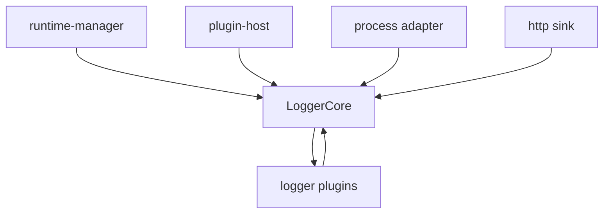
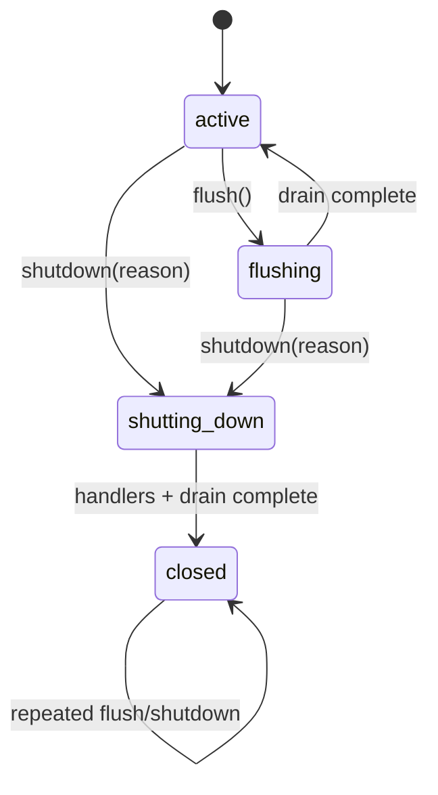

# SDD: Logger 生命周期与可靠性演进

- 状态：Proposed
- 日期：2026-08-10
- 范围：`packages/logger`
- 目标阶段：Internal Preview 期间完成；不改变现有基础日志 API

## 1. 摘要

当前 `@migaia/logger` 采用薄核心 + 插件架构：`LoggerCore` 负责 entry、pipeline、sink、hook、flush、shutdown 和 logger 组合；level、color、batch、http、process 等语义由插件提供。该方向正确，但生命周期状态、异步 drain、entry 可变性和失败传播仍存在可靠性风险。

本设计将 logger 的核心边界明确为：

1. `LoggerCore` 是单实例事件管线与生命周期协调器。
2. Runtime manager 只提供宿主能力，不拥有 logger 生命周期。
3. Process plugin 只负责进程事件适配，不自行复制 shutdown 状态机。
4. 所有异步输出都必须进入统一的可观察任务集合。
5. Entry 在 pipeline 中可变，但进入 sink 后必须视为已提交；结构化字段不再靠参数猜测。

## 2. 现状与已有正确边界

- 核心不理解 level、颜色、批量和 HTTP，插件通过 `ILoggerPluginCore` 注入能力。
- `@migaia/plugin-host` 负责插件安装、shared 能力、配置更新和资源撤销。
- `runtime-manager.ts` 隔离 Node/Bun/浏览器环境，避免核心直接依赖完整 Node API。
- batch 与 http 通过 shared factory 协作，没有直接 import 对方运行时实现。
- `extends()` 通过 logger id 和运行时路径检测循环。

目标依赖方向：



核心与插件之间只能通过公开类型和 core 原语通信；核心不得依赖具体插件。Process adapter 可以依赖宿主 runtime，但不能把进程全局状态混入普通 logger 实例。

## 3. 当前问题

### 3.1 Process plugin 的全局 shutdown 状态无法复用

`ProcessPlugin.#shuttingDown` 在首次 graceful shutdown 后不会复位。插件卸载会清除 listener 和 runtime 引用，却没有清除该状态。测试隔离、热重载或同一进程内重新安装 process plugin 时，新的 shutdown 请求会被直接忽略。

位置：`packages/logger/src/plugins/process.ts`。

### 3.2 `beforeExit` 没有受控重入

`beforeExit` listener 对每个 core 启动 `void c.flush()`，不等待、不去重，也没有“正在 flush”状态。flush 产生异步任务时可能再次触发 `beforeExit`，造成重复 flush，且无法表达最终退出条件。

### 3.3 异步失败被 sink 层吞掉

HTTP 无 batch 路径将发送 Promise `.catch()` 后返回已成功的 Promise。核心因此无法区分“已发送”和“发送失败”。失败只能打印到 console，不能被统一 failure policy、监控或调用方处理。

### 3.4 flush 缺少统一 drain 语义

当前 flush 依次等待本 logger pending、执行 flushers、再次等待 pending、最后 flush extends targets。目标 logger 的转发和异步处理可能在前一轮快照之后才产生任务，因此“flush 返回”不严格等价于整个 logger graph 已清空。

### 3.5 Entry 的只读契约不完整

`ILogEntry` 的 readonly 只约束 TypeScript 属性赋值；`data`、`meta`、`context`、`args` 内部引用以及 `Date` 仍可被插件修改。插件执行顺序会影响后续 sink 看到的内容。

### 3.6 隐式 meta 推断造成语义歧义

`#buildEntry()` 将最后一个普通对象参数自动视为 `meta`。因此同一调用既可能被当作 console 参数，也可能被 JSON/HTTP sink 当作结构化字段，行为取决于 sink。

### 3.7 HTTP retry 策略过宽

当前所有 fetch 异常和非 2xx 响应都进入 retry，包括 400、401、403 等通常不可重试错误；请求也没有统一取消信号，shutdown 超时后可能仍继续执行。

## 4. 目标与非目标

### 4.1 目标

- 同一 runtime 内 process plugin 可安装、卸载、再次安装，生命周期状态正确。
- shutdown、flush、beforeExit、signal、crash 共享一套可验证的状态机。
- `flush()` 返回时，当前 logger graph 内可观察的输出任务已完成或明确失败。
- sink 不吞异步失败；失败传播策略由核心统一处理。
- Entry 的 pipeline 可变性和 sink 提交边界明确。
- 结构化 meta 使用显式 API，保持 console 参数与 JSON 字段语义稳定。
- HTTP 只对可重试失败重试，并支持取消。

### 4.2 非目标

- 本阶段不更改 `Logger`、`level()`、`color()` 等主要公开调用方式。
- 不引入新的日志级别体系。
- 不把 logger 改造成全局 singleton。
- 不在本阶段实现持久化离线队列或跨进程日志代理。

## 5. 目标设计

### 5.1 Core lifecycle state machine

`LoggerCore` 增加内部生命周期状态：`active`、`flushing`、`shutting-down`、`closed`。状态只允许单向推进，重复调用具有幂等语义：



- `flush()` 并发调用返回同一个 in-flight Promise。
- `shutdown()` 并发调用共享同一个 shutdown Promise，第一次 reason 生效。
- `closed` 后新的日志调用不执行 sink；实现选择为静默丢弃或通过可配置错误处理报告，必须在 API 文档中固定。
- 所有 plugin dispose 必须在 core 进入 `closed` 前完成。

### 5.2 统一异步任务追踪

引入内部 task registry，替代散落的 Promise 追踪：

- `defer()` 注册调度任务。
- sink 返回的 Promise 注册为输出任务。
- extends 转发产生的 dispatch 注册到目标 graph 的 drain。
- task 记录来源（`defer`、`sink`、`flush`、`forward`）和失败信息。
- drain 采用“注册任务 → 等待当前批次 → 重复直到稳定”的循环，并设置可选超时。

失败不得通过 resolved Promise 伪装成功。默认策略保持“不让日志异常打穿业务调用栈”，但必须进入 logger failure hook/diagnostic sink；shutdown 时由 policy 决定继续等待、放弃还是报告。

### 5.3 Process plugin 变成 runtime adapter

Process plugin 保留静态 listener 去重，但状态拆分为：

- runtime binding：当前绑定的 process 对象。
- listener registry：已安装的监听器。
- active cores：当前注册的 logger core。
- shutdown promise：当前 runtime 的唯一 graceful shutdown 操作。

当 active cores 归零时清理全部状态，包括 shutting-down 标志。若 shutdown 已经开始，则拒绝新的 core 注册，直到本轮结束；热重载场景必须等待旧 runtime binding 完成清理后再安装。

`beforeExit` 只调用 runtime 级共享 flush promise，不为每个 core 启动无关联的 fire-and-forget 任务。

### 5.4 Entry boundary

保留 pipeline 阶段可修改 entry 的能力，但定义两个边界：

1. `before`/pipeline：entry 是内部可变工作对象。
2. sink 调用：核心创建提交快照；sink 不得再修改后续日志可见状态。

推荐先实现结构化浅快照和受控嵌套字段策略：

- `context`、`args`、`data` 复制容器。
- `time` 使用不可变时间值或在边界转换为 epoch/string。
- `Error.raw` 保留原始引用，但序列化投影由 codec 明确生成。
- 若性能不允许深拷贝，文档必须明确插件不得修改嵌套对象。

### 5.5 显式结构化日志

新增或扩展显式入口，例如：

```ts
logger.dispatchRaw({
  tag: 'info',
  message: 'user updated',
  meta: { userId }
})
```

`log(tag, message, ...args)` 保持 console-style 参数，不再依赖最后一个对象自动推断 meta。自动推断可在兼容阶段保留，但应提供配置开关并标记 deprecated；JSON/HTTP sink 使用 `entry.meta`，console sink 使用 `entry.args`。

### 5.6 HTTP 发送策略

- sink 返回原始发送 Promise。
- 只对网络错误、429 和 5xx 默认重试。
- 4xx（429 除外）直接失败。
- 支持 `AbortSignal`，shutdown 时由 core 或 plugin policy 取消未完成请求。
- `Retry-After` 优先于固定指数退避。
- 失败交由 core failure hook，console 输出只是默认 observer，不是唯一错误通道。

## 6. 迁移顺序

1. **补测试先行**：覆盖 process plugin 重装、beforeExit 重入、flush 并发、extends graph drain、HTTP failure propagation。
2. **抽取 lifecycle primitive**：在 `LoggerCore` 内实现幂等 flush/shutdown 和状态保护，不改变插件 API。
3. **统一 task registry**：迁移 defer、sink、forward、batch 相关等待逻辑。
4. **修复 process adapter**：复位全局状态，改用共享 shutdown promise。
5. **修复 HTTP plugin**：保留 Promise、细化 retry、加入取消和 failure hook。
6. **明确 entry boundary**：先复制容器并补充文档，再评估深冻结成本。
7. **废弃隐式 meta**：增加显式路径，兼容期保留旧行为，最终移除猜测逻辑。
8. **补齐架构测试**：禁止核心 import 具体插件；验证 runtime manager 是唯一宿主能力入口。

每一步都应可独立合并、独立回滚；不得把生命周期改造与日志格式大规模重写放入同一提交。

## 7. 验证边界

### 7.1 单元测试

- process plugin 卸载后重新安装，signal/shutdown 正常生效。
- graceful shutdown 并发调用只执行一次。
- flush 并发调用共享 Promise。
- flush 期间新增 defer/sink/forward 任务，最终全部等待。
- extends 图中多层异步转发不会提前返回或无限循环。
- sink rejection 被记录为 failure，不被误报为成功。
- HTTP 对 4xx、429、5xx、网络错误分别验证 retry 次数。
- `AbortSignal` 在 shutdown/timeout 后终止请求。
- entry 的结构化字段和 console 参数不会互相污染。

### 7.2 包级验证

- `typecheck`
- `typecheck:browser`
- `lint`
- `test`
- `build`

项目要求的实现任务最终执行顺序为：`fmt → lint → test`；若 formatter 尚未配置，交付时明确报告。

### 7.3 架构验证

- logger core 不依赖 `process`、`fetch`、`console` 的具体实现。
- browser build 不泄漏 Node process 类型。
- process plugin 只能通过 runtime manager 访问宿主 process。
- plugin 间协作只通过 shared contract，不新增 batch/http 的直接运行时依赖。

## 8. 风险与取舍

- 统一 task registry 会增加每条日志的 Promise bookkeeping 成本；通过仅追踪异步任务、同步 sink 快路径和 benchmark 控制开销。
- Entry 快照可能增加对象分配；先复制容器，不默认深拷贝任意用户对象。
- failure hook 改变错误可见性；兼容默认仍不抛入业务调用栈，但测试必须证明失败不会静默消失。
- process 全局状态仍然存在，这是进程事件本身的宿主事实；通过 runtime binding 和 reset 条件限制其影响范围。

## 9. 完成标准

- 上述高风险问题均有回归测试。
- `flush()` 和 `shutdown()` 的并发、重复和超时语义写入公共类型/文档。
- process plugin 可以在同一 runtime 中完整卸载并重新安装。
- HTTP 失败不会被 resolved Promise 隐藏。
- logger 包通过 formatter、lint、test、typecheck、build 验证。
- 无新增反向依赖、全局状态泄漏或未记录的兼容行为变化。
