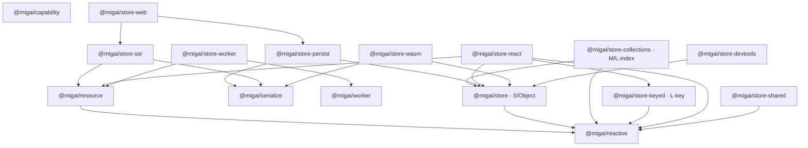

# SDD: Store 平台包级拆分与演进方案

- 状态：Proposed
- 日期：2026-08-09
- 范围：`packages/store`、`packages/rpc`、`packages/store-web`、`packages/wasm`
- 目标阶段：Internal Preview 期间完成；进入 Stable 前移除旧入口

## 1. 摘要

当前 `@migai/store` 已经按源码入口拆出 kernel、store、collections、atom、async、persist、serialize、SSR、React、Worker、WASM、SharedArrayBuffer、middleware 与 devtools，但这些能力仍位于同一个物理 npm 包。源码层的依赖约束不能解决安装体积、独立版本、平台类型环境和独立复用问题。

本设计把平台拆成三类包：

1. 可脱离 Store 使用的基础包：响应式内核、异步资源、序列化、能力闸门、Worker 通信。
2. 按数据寻址模型拆分的状态包：对象状态、结构集合、按键定义。
3. 可选宿主与增强包：React、SSR、持久化、Web、Worker 集成、WASM、共享内存、诊断。

`packages/rpc` 不做机械改名。其 Worker 面向的公开能力进入 `packages/worker` / `@migai/worker`；Store 与 Worker 的响应式集成进入 `@migai/store-worker`。当前通用 RPC 协议实现暂时保留为 `@migai/worker` 的内部 kernel，避免为了“抽象纯度”立即再增加一个小包；若未来出现非 Worker 的独立消费者，再无行为变更地抽出 `@migai/channel`。

`@migai/store` 保留为最小默认包，代表 S 档对象状态，不成为“安装全部能力”的聚合包。M、L-index、L-key 与平台增强必须显式安装。

## 2. 背景与现状

### 2.1 已有正确边界

- kernel 只依赖版本时钟、依赖追踪、调度、所有权和 Runtime 归属。
- `store-protocol.ts` 已把字段构造器和 mutation guard 反转成扩展协议。
- Worker RPC 已从 Store 源码抽到独立 `packages/rpc`。
- Web Storage、IndexedDB、Document hydration 已进入 `@migai/store-web`。
- `architecture.test.ts` 已形成依赖棘轮，可扩展为跨包契约测试。
- Store 文档已明确 S、M、L-index、L-key 四种使用模型。

### 2.2 仍存在的问题

- `packages/store/src` 约有 106 个非测试 TS/TSX 文件、1.8 万行生产代码；一个物理包承担过多发布责任。
- `@migai/store` 的 package export 与源码能力边界不等价，用户安装默认包仍获取全部源码。
- React、DOM、Node/Bun、Web Worker、WASM、SharedArrayBuffer 需要不同 `lib`/`types`，一套 tsconfig 会形成 ambient type 并集并掩盖平台泄漏。
- 小/中/大数据策略目前是文档约定，不是安装与依赖边界。
- `packages/rpc` 的名字过于协议导向，而当前主要产品场景是 Worker 任务、取消、transfer 和端口生命周期。
- `serialize`、`capability`、`Resource` 等能力可用于非 Store 场景，但仍被 Store 命名空间束缚。
- `packages/wasm/rust/target` 当前约 858MB；它不应进入发布清单或架构迁移输入。

## 3. 目标与非目标

### 3.1 目标

- 不安装就不下载、不解析、不获得对应 ambient types。
- 每个包只有一个清晰的变化原因和平台契约。
- Node、Bun、浏览器与 Worker 分别通过独立消费者验证。
- S/M/L API 的选择与物理依赖一致。
- 可复用能力不依赖 `@migai/store`。
- 拆分过程中保持运行语义、取消语义、所有权和 SSR 隔离不变。
- 支持分阶段迁移；任一阶段可发布、可回滚。

### 3.2 非目标

- 本轮不重写响应式算法。
- 不以固定条目数自动切换数据结构；规模边界由业务寻址方式和 benchmark 决定。
- 不让一个 store 在运行时自动从 S 迁移到 M/L；这种隐式切换会破坏身份、订阅和复杂度预期。
- 不提供默认安装全部包的“大而全”入口。
- 不同时更换全部公开 API 名称；包移动与 API 重命名分开进行。

## 4. 设计原则

1. **按寻址模型拆，不按营销数字拆。** “小/中/大”是选型叙事；对象字段、index、key 才是稳定的技术边界。
2. **依赖只能从宿主适配层指向通用层。** 通用层不得反向探测 React、DOM、Worker 或 Node。
3. **平台 API 通过 adapter/manager 注入。** `globalThis` 可用于安全能力探测，但核心不得声明完整 DOM/Node ambient types。
4. **包边界必须可验证。** package.json、tsconfig、exports、bundle budget 和 import-graph test 共同构成边界。
5. **先移动，后改造。** 每次迁移先保持符号与行为不变，再单独做 API 改良。
6. **默认包最小。** `@migai/store` 只覆盖最常见 S 档；增强能力显式安装。

## 5. 目标包拓扑



图中没有可选包指回基础包之外的反向边，也没有循环。

## 6. 包职责

### 6.1 可跨场景复用的基础包

| 包 | 来源 | 职责 | 禁止依赖 |
| --- | --- | --- | --- |
| `@migai/reactive` | `core/runtime`、Signal/Computed/Effect | Runtime、Scope、依赖图、调度、批处理、所有权 | Store、React、I/O、Worker、WASM |
| `@migai/resource` | `resource.class.ts`、async、family cache 的通用部分、flow | 可取消异步派生、Resource、异步 family、FlowTask | Store facade、DOM |
| `@migai/serialize` | `src/serialize` | codec registry、chunk、stream、JSON codec | Store、Web Storage、Worker |
| `@migai/capability` | `src/capability` | 动态加载、启停状态机、按租户隔离、handle 释放 | Store、React、具体能力 |
| `@migai/worker` | 当前 `packages/rpc` 的协议/client/server/adapters | Worker 请求响应、取消、超时、transfer、MessagePort/Web Worker transport | Store、React、WASM |

`tolerant-clone` 暂不独立发布。它只有 middleware/devtools 两个消费者，拆包收益小于版本与文档成本；先作为 `@migai/store-devtools` 内部模块。

### 6.2 按数据模型拆分的 Store 包

| 档位 | 包 | 适用模型 | 主要能力 |
| --- | --- | --- | --- |
| S | `@migai/store` | 少量稳定字段、getter、action、表单/配置/UI 根状态 | `createStore`、raw、StoreResource、对象门面 |
| M | `@migai/store-collections` | 根对象 + 高频局部 index/key 更新 | ObservableArray、逐 cell 懒节点、结构信号、`$own` 集成 |
| L-index | `@migai/store-collections` | 稳定下标的长列表、feed、会话 | 与 M 同一数据结构；区别在使用方式和预算，不另造重复包 |
| L-key | `@migai/store-keyed` | 业务 id、多 scope、多 Provider、SSR 定义复用 | atomDef、familyDef、AtomStore、定义化 optics、淘汰策略 |

不创建 `store-small`、`store-medium`、`store-large`。数字边界会随运行时和 benchmark 改变，且 M 与 L-index 共享同一集合实现；按寻址方式命名更稳定。

### 6.3 Store 可选增强包

| 包 | 职责 | 直接依赖 |
| --- | --- | --- |
| `@migai/store-persist` | Store snapshot/hydrate、迁移、写入状态机、storage protocol | store、serialize |
| `@migai/store-web` | LocalStorage、IndexedDB、Document hydration | store-persist、store-ssr |
| `@migai/store-ssr` | 请求 scope、dehydrate、resource preload、JSON 安全校验 | reactive、resource、serialize |
| `@migai/store-react` | Provider、hooks、并发 capture/commit 协议 | reactive、store、resource、store-keyed；peer React |
| `@migai/store-worker` | `WorkerAdapter` 兼容层、workerComputed、serialize worker plugin | worker、resource、serialize |
| `@migai/store-wasm` | Store FieldBuilder 的 WASM 字段、WASM codec bridge | store、serialize、`@migai/wasm` |
| `@migai/store-shared` | SharedArrayBuffer/Atomics 状态 | reactive |
| `@migai/store-middleware` | mutation policy、action pipeline | store |
| `@migai/store-devtools` | trace、snapshot、diff、time travel、diagnostic clone | store、store-middleware（可选） |

## 7. `packages/rpc` 到 `packages/worker` 的设计

### 7.1 决策

- 目录：`packages/rpc` → `packages/worker`
- 包名：`@migai/rpc` → `@migai/worker`
- 第一阶段保留 `RpcClient`、`RpcServer` 等符号名，避免包移动与 API 改名同时发生。
- 新增 Worker 语义别名：`WorkerClient`、`createWorkerServer`、`WorkerTransport`；内部仍可复用 RPC 协议。
- `memory`、`message-port`、`web-worker` 保持 subpath exports，用于测试、Node worker_threads 与浏览器 Worker。
- `workerComputed` 不进入 `@migai/worker`，它依赖响应式 Resource，归 `@migai/store-worker`。

### 7.2 兼容策略

Internal Preview 阶段提供一个薄的 `@migai/rpc` 兼容包，只 re-export `@migai/worker` 并打印一次开发态 deprecation。迁移完成且仓库无旧 import 后删除。兼容包不被任何新包依赖。

### 7.3 为什么暂不抽 `@migai/channel`

当前 memory/message-port 都服务 Worker/RPC 测试和适配，尚无第二个独立产品消费者。立即拆通用 channel 会增加包数、版本联动和认知成本。触发条件：出现至少两个不依赖 Worker 语义的生产消费者，或协议需要独立版本承诺。

## 8. 数据规模策略

### 8.1 S：对象状态

- 成本模型：每个固定字段一个节点；getter 建派生边。
- 优点：API 简单，横切能力完整。
- 禁止：把 10k/100k 高频变化条目作为普通数组字段整表替换。
- 包：`@migai/store`。

### 8.2 M：结构集合

- 根 UI/聚合状态仍在 `@migai/store`。
- 高频路径进入 `@migai/store-collections`。
- 节点按被观察的 cell 懒创建，批量更新只遍历 materialized cells。
- 适合树表、可编辑表格、中型列表和局部更新。

### 8.3 L-index：稳定下标的大列表

- 与 M 共享集合包，避免实现分叉。
- 公共 API 强化分页窗口、range subscription、批量 splice、分段加载。
- 后续改造重点：窗口节点回收、稀疏 cell registry、分块 snapshot，而不是再引入一个“大数据 store”。

### 8.4 L-key：业务主键和多 scope

- 使用 definition + AtomStore，而非全局实例 atom。
- family 必须具备显式 dispose、TTL/LRU 或 scope 生命周期。
- Provider/SSR 每个 scope 拥有独立实例；定义对象可以跨 scope 复用。
- 包：`@migai/store-keyed`。

### 8.5 超大连续数值数据

- 不属于普通 Store 档位。
- 连续 TypedArray、批量编解码、SIMD 才进入 `@migai/store-wasm`。
- 跨线程固定布局、低延迟共享才进入 `@migai/store-shared`。
- 复杂对象跨线程优先使用 `@migai/worker` 的字节传输，不用 SAB 模拟对象图。

规模阈值不写死到 API。发布时用 benchmark 给出建议区间；应用根据寻址方式、更新频率、观察窗口和内存预算选择。

## 9. TypeScript 与发布约束

### 9.1 基础配置

通用包基线：

```json
{
  "compilerOptions": {
    "target": "ES2022",
    "lib": ["ES2022", "ESNext.Disposable"],
    "types": [],
    "module": "ESNext",
    "moduleResolution": "Bundler",
    "strict": true,
    "verbatimModuleSyntax": true
  }
}
```

平台包覆盖完整 `lib` 数组：

- Web：`ES2022 + ESNext.Disposable + DOM + DOM.Iterable`
- Worker：`ES2022 + ESNext.Disposable + WebWorker`
- Node/Bun 测试：通用 lib + `types: ["node"]`；Bun 专属 API 另建消费者配置
- React：DOM 只进入 React DOM 适配测试，不进入 reactive/store declaration build

### 9.2 发布规则

- 每个包生成真实 `dist/*.js`、`.d.ts`、source map。
- 发布 exports 不指向 `src/*.ts`。
- `files` 只包含 dist、README、LICENSE；WASM 包显式排除 `rust/target`。
- 每个包 `sideEffects` 显式声明。
- Node ESM 产物使用 `.js` 相对说明符，或由 bundler 完成最终输出；不得输出 Node 无法解析的 extensionless ESM。
- peer dependency 只用于 React 等宿主；内部 workspace 依赖使用正常 dependency。

## 10. 迁移计划

### Phase 0：冻结契约与证据

- 保存当前 public export manifest。
- 为 S/M/L-index/L-key 建立行为与 benchmark 基线。
- 把现有 import-layer test 升级为跨 package DAG test。
- 增加 Node、Bun、浏览器、Worker 四类 consumer fixtures。
- 修复根级 typecheck 被 WASM 无 tsconfig 阻断的问题。

完成标准：没有移动源码，但每个后续阶段都有可判定回归的基线。

### Phase 1：先抽无 Store 反向依赖的叶子

顺序：`serialize` → `capability` → `reactive` → `resource`。

- 机械移动，保持符号名和测试。
- Store 暂通过 package dependency 使用新包。
- 每抽一个包，删掉 architecture test 中对应旧层。

完成标准：新包可独立 build/typecheck/test，且声明文件不引用 `@migai/store`。

### Phase 2：RPC/Worker 迁移

- 建立 `packages/worker`。
- 移动当前 RPC core 与 adapters。
- 增加 `@migai/rpc` compatibility package。
- 把 store worker 与 serialize worker 插件移入 `@migai/store-worker`。

完成标准：`@migai/worker` 独立运行 memory、MessagePort、Web Worker contract tests；Store 不再直接实现协议。

### Phase 3：拆数据模型

- `@migai/store` 收缩为 object facade。
- collections 移到 `@migai/store-collections`。
- definition atom、AtomStore、family、optics 移到 `@migai/store-keyed`。
- legacy instance atom 留在兼容入口，不进入新教程。

完成标准：三个包可以单独安装；S 包依赖图中不存在 collections/keyed。

### Phase 4：拆横切能力

- persist、SSR、React、middleware、devtools 分包。
- 保持 `@migai/store-web`，改依赖到新 persist/SSR 包。
- 将 StoreResource 的 React capture 部分放到 React 包，核心 lease/version/request state 留在 resource/store。

完成标准：无 React 应用不会安装 React 包；无持久化应用不会安装 serialize/persist/web。

### Phase 5：拆高成本能力

- WASM FieldBuilder 与 codec bridge 移到 `@migai/store-wasm`。
- SharedArrayBuffer 移到 `@migai/store-shared`。
- 增加下载体积、初始化时间、内存与跨线程基准门槛。

完成标准：默认 Store 安装不含 `.wasm`、Rust 源码或 SAB 实现。

### Phase 6：清理兼容层

- 仓库内迁移全部旧 import。
- 删除 `@migai/rpc` compatibility package。
- 删除 `@migai/store/*` 中已迁出的转发入口。
- 更新平台指南，以新包名作为唯一主路。

## 11. 验证矩阵

| 维度 | 必须验证 |
| --- | --- |
| 依赖 | 包 DAG 无循环；通用包声明中无 Store/React/DOM/Node 泄漏 |
| 类型 | Node、Bun、Browser、WebWorker consumer fixtures 分别通过 |
| 运行时 | 取消、timeout、dispose、SSR 请求隔离、跨 Runtime 拒绝保持一致 |
| 构建 | 每个 exports 条件均可 import；Node 原生 ESM 可执行 |
| 体积 | 默认 `@migai/store` 不包含 optional package；每包设 gzip budget |
| 性能 | S 写入、M 局部更新、L-index 窗口更新、L-key churn、SSR dehydrate 回归 |
| 发布 | `npm pack --dry-run` 不含测试、benchmark、Rust target、源码缓存 |

建议初始性能门槛：同机同 Node/Bun 版本下，相比拆分前中位数回退不超过 5%；内存回退不超过 10%。超出则阻止迁移合并，先定位跨包包装或重复实例。

## 12. 兼容与版本策略

- 当前全部包仍是 `0.x`/private，可在 Internal Preview 内调整，但每阶段仍保留迁移说明。
- 兼容转发只存在一个迁移窗口；新包不得依赖兼容包。
- 类型别名和运行时 re-export 同时提供，避免只兼容 TS、不兼容 JS。
- 跨包 symbol 品牌必须来自唯一基础包实例，避免 workspace 重复版本造成 `FIELD_BUILDER`、ownership brand 不相等。
- 所有内部包版本先锁步发布；边界稳定后再允许独立版本。

## 13. 主要风险与应对

### 高：多份 reactive kernel

不同包若安装出两份 `@migai/reactive`，Runtime ownership 和 symbol identity 会失效。应使用严格 workspace peer/dependency 策略、单例自检和 consumer fixture 验证。

### 高：StoreResource 被错误切开

StoreResource 同时包含 cache policy、request generation、lease/version ownership 和 React capture。按文件粗暴移动会产生循环。应先把 React capture 定义成 adapter protocol，再移动 React 实现。

### 高：机械 rename 把通用 RPC 重新绑死到 Store

`@migai/worker` 必须保持零 Store 依赖；`workerComputed` 只能在 `@migai/store-worker`。

### 中：包数量过多

只有满足以下至少一项才独立发包：独立宿主环境、明显下载成本、独立消费者、独立稳定性、可避免重依赖。否则保留为现有包的 subpath/internal 模块。

### 中：跨包调用导致性能回退

ESM 静态调用本身成本低，主要风险是包装层、重复对象和重复 kernel。迁移阶段禁止增加代理 facade；用直接 re-export 和原类移动。

### 中：文档继续按旧入口教学

API 示例与 package exports 建立编译测试；旧入口只出现在 migration guide。

## 14. 待定事项

1. `@migai/resource` 是否包含 FlowTask：建议包含，二者共享 Abort/生命周期；若出现独立非响应式 flow 消费者再拆。
2. `@migai/store-react` 是否进一步拆 `@migai/reactive-react`：当前不拆，等待 Store 外第二个 React 消费者。
3. `@migai/worker` 是否最终抽 `@migai/channel`：按第 7.3 节触发条件决定。
4. `@migai/store-devtools` 是否依赖 middleware：默认只依赖 store；需要 action event 时通过可选 adapter 接入，避免强依赖。

## 15. 验收标准

- 默认安装 `@migai/store` 只得到 S 档对象状态和 `@migai/reactive`。
- M/L-index、L-key、React、Web、SSR、Worker、WASM、SAB、persist、devtools 均需显式安装。
- `@migai/reactive`、`@migai/resource`、`@migai/serialize`、`@migai/capability`、`@migai/worker` 可在不安装 Store 时独立使用。
- `packages/rpc` 被 `packages/worker` 取代，旧包只作为临时兼容层。
- 所有 package consumer fixtures、边界测试、行为测试和性能门槛通过。
- 根级 typecheck/build/test 能一次性验证完整 workspace。
